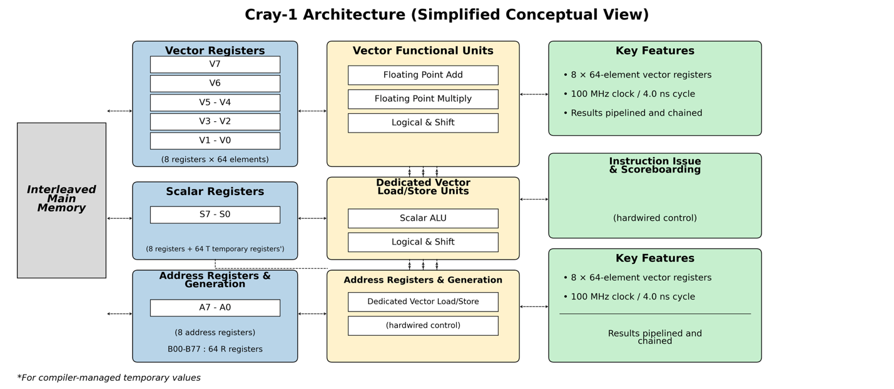
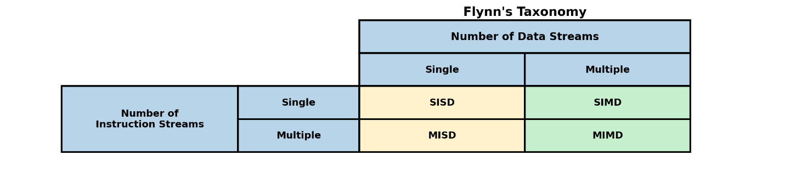
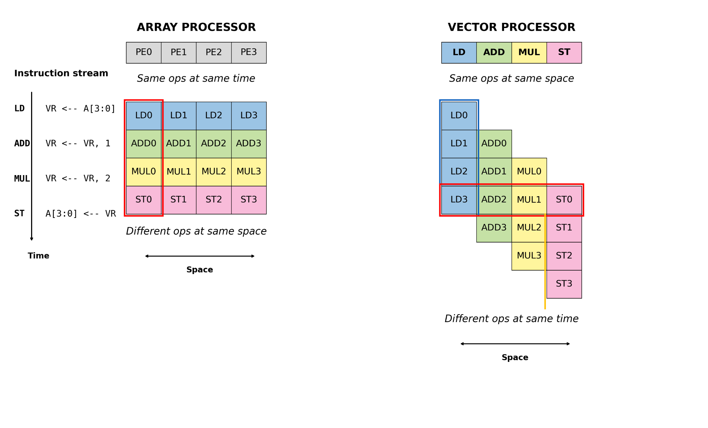
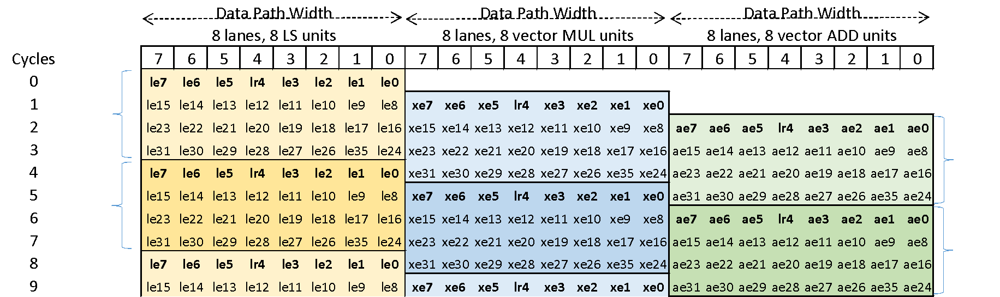
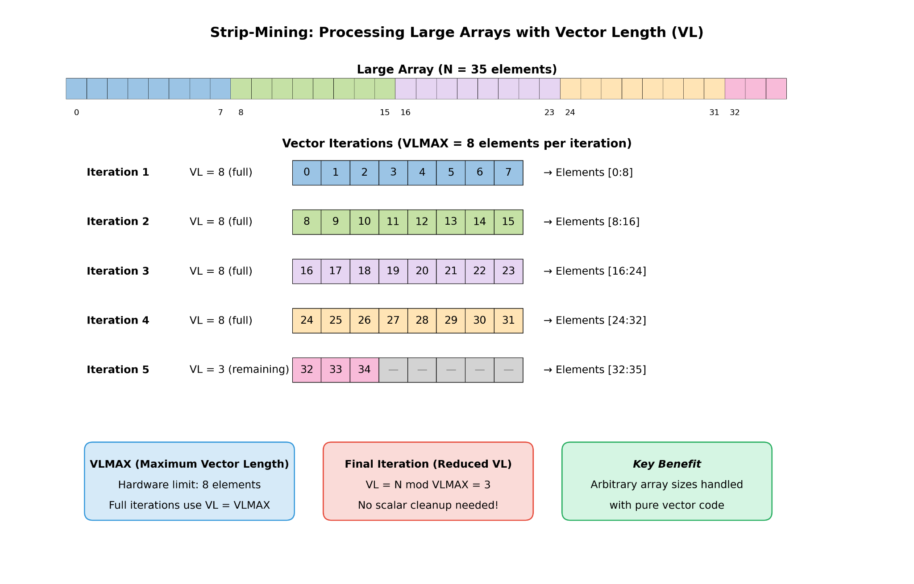
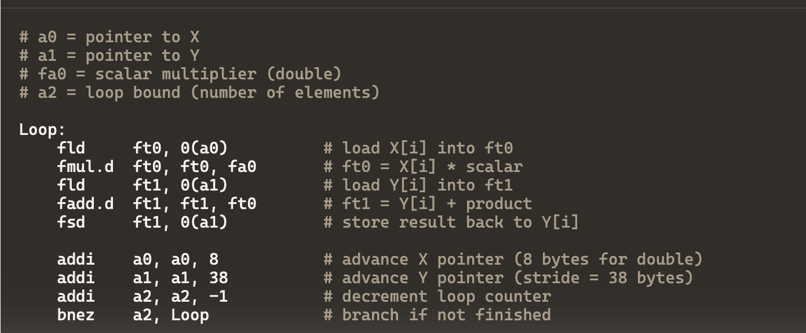
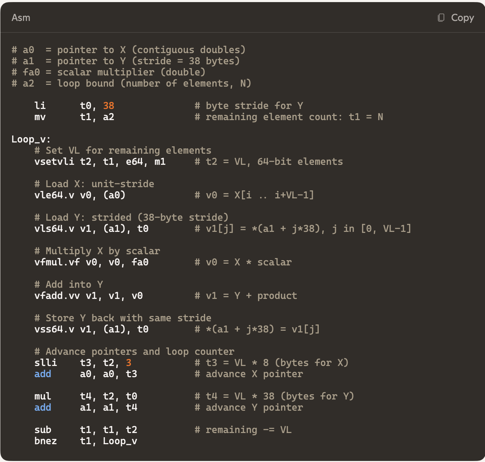

# Chapter 1 — RISC-V Vector Extension Demystified

If you are reading this, there's a good chance you've already tried to understand the official RISC-V Vector Extension (RVV) specification and bounced off it at least once. You're not alone.

When we first presented this material as a three-hour live tutorial, the most common reaction was some variation of:

> "This is the first time the RISC-V Vector Extension has actually felt *digestible*."

Engineers who had been through the spec multiple times suddenly found that, with the right mental model and some worked examples, the ideas were not only understandable—they were elegant.

This book is the written, expanded version of that tutorial: a guided tour intended to turn the RISC-V Vector Extension from a forbidding PDF into a practical tool you can reason about, implement, and program with confidence.

In this first chapter, we'll set the stage:

- What a vector processor is and how it differs from classic SIMD and graphics engines
- Why RVV was designed the way it is
- The core terminology: vector register length, element width, grouping, masks, vector length (VL), strip mining, and chaining
- The architectural challenges that make vector design very different from simply "widening" a scalar core

Later chapters will go deeper into the ISA details, memory operations, compute instructions, and real code. But first we need a solid conceptual foundation.

## 1.1 The Voice Behind the Vectors

The ideas in this chapter come from more than three decades of my microprocessor design experience.

I am your guide for the technical parts, a hardware architect who has spent over 40 years building microprocessors: x86, Arm, PowerPC, ARC and now RISC-V. That perspective matters. When I praise the simplicity of RISC-V, it's not because I've read a white paper; it's because I've spent real silicon budget implementing other ISAs and know what hurts.

## 1.2 What This Chapter Is (and Isn't)

This chapter is not a line-by-line commentary on the RVV specification. Instead, it's a practical introduction that gives you:

- The *mental models* you need to understand later details
- The *terminology* that appears throughout the spec and implementation documents
- A clear distinction between vector processors, SIMD, and GPUs
- The why behind RVV: why it's scalable, why it's register-based, why concepts like VL, SEW, and LMUL exist

Later chapters will drill into:

- Control and status registers (CSRs) like vtype, vl, sew, and vstart
- Memory operations (unit-stride, stride, index, segment)
- Arithmetic and logical operations
- Practical examples: loops, dot products, matrix multiplies, FFTs, and AI/ML kernels

Think of this chapter as learning the grammar and vocabulary before you start reading poetry.

## 1.3 Why Vector Processors Matter Now

Vector processors are not new. Machines like Cray's vector supercomputers and Fujitsu's vector systems were doing vector math decades ago. What's changed is the context:

The Cray-1 separates scalar and vector execution using dedicated register files and deeply pipelined functional units. Vector registers feed multiple arithmetic pipelines, enabling chaining and sustained throughput. This diagram is a conceptual illustration intended to highlight execution structure rather than a literal hardware block diagram.



**Figure 1-1.** Cray-1 Architecture (Simplified Conceptual View)

- AI and machine learning workloads are inherently data-parallel.
- Signal processing, cryptography, graphics, and scientific computing still demand high throughput over arrays of numbers.
- In many systems there's a need for something more flexible and programmer-friendly than "just write a GPU kernel," and more efficient than pounding everything through scalar cores.

This is where the RISC-V Vector Extension comes in:

- It defines a scalable vector ISA that can work for small embedded cores or wide data center engines.
- It keeps the RISC philosophy: load/store design, simple fixed-field encoding, and clear separation between scalar and vector state.
- It is designed so that one binary can run on different implementations with different vector register widths, without recompilation.

To understand why that last point is so important, we need to contrast vector processors with the more familiar world of SIMD.

## 1.4 Flynn's Taxonomy: Where Vectors Fit

In the 1970s, Michael Flynn proposed a classification of computer architectures based on instruction and data streams:

- **SISD** – Single Instruction, Single Data
  - Classic scalar processors: one instruction operates on one data element at a time.
- **SIMD** – Single Instruction, Multiple Data
  - One instruction applies to multiple data elements in parallel. This covers vector processors, classic SIMD units, and fixed-width vector instructions in CPUs.
- **MISD** – Multiple Instruction, Single Data
  - Rare in practice.
- **MIMD** – Multiple Instruction, Multiple Data
  - Multiprocessor and multicore systems, including most modern servers.



**Figure 1-2.** SIMD vs. Vector Execution Models

SIMD architectures exploit parallelism by operating on a fixed number of elements per instruction, while vector processors treat a single instruction as a stream of operations over many elements. Vector execution overlaps computation across time using deep pipelines and chaining, enabling scalable performance without encoding vector width into the ISA.

Both SIMD extensions (like SSE, AVX, NEON) and vector processors fall under SIMD in this taxonomy. The key difference isn't in Flynn's label; it's *how* they execute over datasets, and how they scale.

## 1.5 SIMD: Fixed-Width Parallelism

Consider a 32-bit scalar core.

- In a classic scalar design, an ADD instruction processes one 32-bit value at a time.
- If you add a 512-bit SIMD unit, that same instruction "style" (but with a different mnemonic) can process 16 parallel 32-bit elements (512 / 32 = 16).

At 1 GHz, if you could issue one such SIMD instruction every cycle, your peak throughput for 32-bit operations would be:

- 16 operations per cycle × 1 billion cycles per second = 16 Giga-ops/sec.

For 8-bit elements in a 512-bit register, you'd operate on 64 elements per instruction, giving 64 Giga-ops/sec peak. Each time you widen the SIMD register, you scale throughput—*in theory*.

In practice, several problems appear:

1. **New width, new ISA baggage**
   - Intel's MMX (64-bit), then SSE (128-bit), then AVX (256-bit), then AVX-512 all added new instruction sets or encodings for each width.
   - Programmers and compilers must deal explicitly with which width is available and targeted.

2. **Binary incompatibility**
   - An executable written for one width doesn't automatically scale to another width.
   - To fully exploit new hardware, you often need new binaries or dynamic code paths.

3. **Instruction explosion**
   - Each new width tends to come with additional specialized operations, making the ISA huge and complex.

The result is a SIMD extension model where vector width is baked into the ISA and into your binaries.

RISC-V vectors take a different path.

## 1.6 Vector Processors: Streams Over Time

A vector processor still executes single instructions over multiple elements, but the core idea is that a *single vector instruction* conceptually represents a loop over elements.

Imagine a vector instruction like:

> "Multiply vector X by constant A and accumulate into vector Y."

Instead of writing a scalar loop with 64 iterations and all the loop control overhead, a vector processor lets you describe the operation once:

- Load 64 elements of X
- Multiply them by A
- Load 64 elements of Y
- Add
- Store back 64 elements

One vector instruction might internally break into multiple micro-operations that work on subsets of the elements (we'll call these "micro-ops" or "micro-ops in lanes"), but that's an implementation detail. From the ISA's point of view, you issued one instruction that operates on a vector length worth of data.

Two ideas are central here:

1. **VL (Vector Length)** – the number of active elements for a given operation.
2. **Chaining** – the ability to start using results of part of a vector operation before the entire vector operation has completed.

We'll come back to VL and chaining soon. First, let's look at another important mental model: time versus space.

## 1.7 Time–Space Duality: Array vs Vector Processors

It helps to visualize data-parallel machines along two axes: how much hardware you replicate in *space*, and how much work you schedule across *time*.

As shown in Figure 1-3, array processors scale performance spatially by replicating processing elements, while vector processors scale performance temporally by streaming data through pipelined functional units. Both models execute single instructions over multiple data elements, but expose different trade-offs in hardware complexity and programmability.



**Figure 1-3.** Time–space duality of data-parallel architectures.

### 1.7.1 Array Processors

In an array processor, you duplicate multiple processing units side by side. For example:

- 4 processing elements (PEs)
- Each PE executes the same instruction, in lockstep, on different data

In each time step:

- PE0 processes element 0
- PE1 processes element 1
- PE2 processes element 2
- PE3 processes element 3

The instruction stream is broadcast; data streams are distinct. This is a very "spatial" view: scale performance by adding more PEs.

### 1.7.2 Vector Processors

A vector processor can be thought of more like a deep pipeline over time.

Consider a sequence of three vector instructions: VLOAD, VADD, VMUL over a vector of length 64.

- Internally, the VLOAD might move data in chunks (say 4 elements at a time).
- The moment the first chunk is loaded, VADD can begin operating on it.
- When VADD has partial results, VMUL can begin.

The pipeline looks like a scalar pipeline, but each stage processes a chunk of the vector. You still have multiple functional units (lanes), but the key is that data flows through the pipeline over time.

If a full vector instruction is conceptually "Load 64 elements," in hardware that might:

- Break into 16 micro-ops of "load 4 elements" each
- Forward the results from each micro-op to subsequent operations as soon as they're ready

You can imagine the same total throughput as four SIMD operations per cycle, but the model exposes *fewer instructions* to software and more structure to hardware.

## 1.8 Chaining: The Secret Sauce

The term chaining is crucial to vector processors.

In a scalar pipeline, an instruction typically must complete before its result is used by the next instruction (barring forwarding from a single execution unit). As shown in Figure 1-4, chaining allows downstream vector instructions to consume partial results from upstream instructions before full completion. This overlap reduces apparent latency and sustains throughput without speculative execution or wide instruction issue.



**Figure 1-4.** Vector instruction chaining across pipelined functional units.

In a vector machine:

- A single vector instruction is internally decomposed into multiple element groups or lanes.
- As soon as one group's result becomes available (say, the first 8 elements), that partial result can be chained into the next vector instruction.
- The second vector instruction can start working on those elements immediately, even though the first vector instruction is still working on later elements (3 more cycles to complete the vector load operation).

This allows:

- Higher throughput
- Lower apparent latency for long vectors
- Better utilization of functional units

Chaining is what makes a vector processor more than "just a big SIMD unit." SIMD units can forward results between instructions, but they don't treat a single instruction as a pipeline of multiple micro-ops whose partial results can stream into subsequent vector operations.

In this book, when we say "vector processor", we generally mean an implementation that supports this sort of internal micro-op decomposition and chaining.

## 1.9 From MMX to AVX-512: A Brief History Lesson

To appreciate the design of RVV, it's worth taking a quick look at how x86 SIMD evolved (see ["The Evolution of SIMD: From SSE to AVX-512 and Beyond"](https://www.linkedin.com/pulse/evolution-simd-from-sse-avx-512-beyond-md-jannatul-nayem-yfabc/) by Md. Jannatul Nayem):

- **MMX (1990s):**
  - 64-bit registers
  - Integer operations over 8-, 16-, and 32-bit elements

- **SSE and successors:**
  - 128-bit registers
  - Added floating-point support
  - More operations for graphics, media, and scientific computing

- **AVX:**
  - 256-bit registers
  - Wider operations, more throughput

- **AVX-512:**
  - 512-bit registers
  - Many new instructions, masking, and more sophisticated operations

At every step, Intel added more instructions, new encodings, and new complexity. The ISA grew large, and supporting all generations at once is costly in hardware and software.

RISC-V vectors deliberately avoid this trap by:

- Separating the instruction semantics from the actual vector width
- Making the vector length and element width programmable at runtime
- Letting the implementation choose the physical VLEN (vector register width) while the software queries and adapts via VL and VTYPE

The goal: one ISA, many implementations, from narrow embedded cores to wide data-center engines, without endless new instruction variants.

## 1.10 An RVV Vector Processor at a Glance

At a high level, a RISC-V core with vector support looks like this:

- **Scalar core**
  - Integer register file (x-registers)
  - Optional scalar floating-point register file (f-registers)
  - Scalar functional units and load/store units

- **Vector unit**
  - Vector register file (v-registers)
  - Vector arithmetic and logical functional units (include both integer and floating-point)
  - Vector permutation units
  - Vector load/store unit(s)
  - Control logic, including dependency tracking (scoreboard, queues)

The vector register file is substantially wider than scalar registers. For example, in a design with 512-bit vector registers:

- Each vector register holds multiple elements, depending on the chosen SEW (Standard Element Width):
  - SEW=8 → 64 elements per register
  - SEW=16 → 32 elements per register
  - SEW=32 → 16 elements per register
  - SEW=64 → 8 elements per register

There are typically 32 vector registers (v0–v31), the same number of scalar and floating point registers for the simplicity of using the same source and destination register bit fields in the instruction mnemonics.

A vector instruction might say: "Add vector register v1 to v2 and store into v3." Internally, the vector unit reads the appropriate elements from the vector register file, feeds them to the functional units, and writes the results back, potentially over many cycles, and potentially chained with other instructions.

## 1.11 Lanes and Locality

To achieve high clock frequencies, vector implementations are usually divided into lanes.

- Each lane handles a subset of the elements for each vector register.
- For instance, in a 512-bit design with 4 lanes, each lane might operate on 128 bits of each vector register at a time.
- The vector register file is physically partitioned across these lanes.

The benefit:

- Wiring is shorter within each lane, which improves timing and allows scalability by using multiple lanes.
- Each lane can have its own local functional units (ALU, multiplier, load/store slice).
- Synchronization across lanes is simplified because each lane processes a consistent portion of the vector.

When we later discuss chaining, strip mining, and VL, it's helpful to imagine that each instruction is being "stretched" across these lanes over multiple cycles.

## 1.12 Strip Mining: Handling Arbitrary Vector Sizes

Real programs rarely operate on arrays whose length matches the maximum number of elements you can hold in a single vector register. If your vector registers can hold 64 elements (VLEN=512 bits, SEW=8), what happens if you need to process 200 elements?

You apply strip mining, a software pattern that breaks an iteration space into chunks that fit the hardware.

Suppose:

- VLEN / SEW = 64 elements per register (VLMAX)
- You have N = 200 elements to process

You can structure your loop as:

1. Set VL = 64, process elements 0–63
2. Set VL = 64, process elements 64–127
3. Set VL = 64, process elements 128–191
4. Set VL = 8, process elements 192–199 (the remaining 8 elements)

This way:

- The hardware always processes at most VL elements.
- The vector length, VL, is a programmable value stored in a CSR.
- The hardware doesn't need to "know" the total N; it just respects VL.

Strip mining is entirely a software pattern, but RVV provides mechanisms (VL, VLMAX, and loop idioms) that make this pattern efficient and natural.

Strip mining can also be performed in reverse order, which is especially useful when the total number of elements is not known in advance. In this approach, the partial chunk is processed first (for example, VL = 8 for elements [192:199]), and subsequent iterations use the full VL while stepping backward through the remaining data. Reverse-order strip mining is advantageous when data is naturally aligned at the end of an array, when an algorithm already traverses data from high addresses to low, or when decrementing a pointer toward zero simplifies loop control.



**Figure 1-5.** Strip mining using programmable vector length (VL).

Large iteration spaces are processed in chunks that fit within the maximum vector length supported by the hardware. The final iteration uses a reduced VL to handle remaining elements, allowing vectorized code to operate on arrays of arbitrary size without special-case scalar cleanup.

A critical feature that enables efficient strip mining is the **first fault load instruction**. This instruction handles an important edge case: what happens when you don't know exactly how much data you can load without hitting a memory boundary or page fault?

## 1.13 Static vs Dynamic Instructions: Why Vectors Are Efficient

Consider a simple scalar loop:

```c
for (int i = 0; i < 64; i++) {
    y[i] += a * x[i];
}
```

A scalar compiler targeting a scalar core will generate:

- Loop setup: initialize i, set loop bounds
- Inside each iteration: load x[i], multiply by a, load y[i], add, store y[i], increment i, branch



You might end up with:

- A dozen or so instructions in the loop body
- 64 iterations
- On the order of hundreds of dynamic instructions executed

Now with a vector processor and a VLEN that supports 64 elements at the chosen SEW:

- You set up vector registers once
- One vector load gets 64 elements of x
- One vector multiply multiplies all 64 elements by a
- One vector load gets 64 elements of y
- One vector add adds across all 64 elements
- One vector store writes back all 64 elements

Roughly six or so vector instructions can replace hundreds of scalar ones. Static instruction count and dynamic instruction count both drop dramatically.



This reduction in instruction traffic:

- Frees up your front-end pipeline
- Lowers power due to fewer instruction fetches and decodes – the most significant is a single vector load or store instead of 64 scalar loads or 64 scalar stores
- Simplifies dependency graphs at the scalar level (vector dependencies are handled inside the vector engine)

RVV is designed so that these vector instructions remain high-level and flexible, not tied to a specific physical vector width.

## 1.14 The Real Hardware Challenges

If vector processors are so good, why not just keep making them wider and wider?

Two main reasons: ports and stalls. The current AI and ML applications require large data sets for decision making which signifies the importance of vector processors.

### 1.14.1 Register File Ports

The vector register file is enormous compared to scalar registers:

- With 512-bit registers, 32 vector registers, and multiple functional units, the number of bits that must be read and written each cycle adds up quickly.
- To keep all these functional units fed, you need multiple read and write ports on the register file.
- But each additional port on a large register file adds:
  - Silicon area
  - Power consumption
  - Timing complexity (longer wires, more capacitance)

If you try to give every unit a fully parallel view of a huge register file, the design becomes physically impractical.

This drives the need for careful design of lanes, limited port counts, and intelligent scheduling and chaining.

### 1.14.2 Pipeline Stalls at 512 Bits and Beyond

When you stall a scalar pipeline, you're freezing something like 64 bits of data at a time (one 64-bit value moving through a stage).

When you stall a vector pipeline with 512-bit datapaths across multiple stages:

- You are stalling hundreds or thousands of bits at once. Stalling means that the data must be held in register until the operation can be resumed.
- Pipeline registers become large and switching all those bits consumes power and affects timing.

Designers must carefully choose:

- How wide each stage is
- How many elements are processed per cycle per lane
- How to forward partial results without creating enormous stall and flush paths
- Algorithm choices: (1) actual stalling (2) scheduling so data flows without stalling or (3) replay of the operation. The last two are "fire-and-forget" approaches—once an operation is issued, it proceeds without blocking the pipeline, either by careful scheduling that guarantees data availability or by replaying operations when hazards are detected.

### 1.14.3 Out-of-Order Execution and Precise Exceptions

Scalar out-of-order cores rely heavily on:

- Register renaming to create a large physical register file
- Reorder buffers (ROB)
- Scoreboards

Extending these concepts naively to 512-bit vector registers multiplies the storage requirements:

- A ROB tracking 128 or 256 in-flight instructions, each potentially associated with 512-bit vector results, becomes prohibitively large.
- Supporting precise exceptions (e.g., interrupts that must see the architectural state "as if" a given instruction has completed or not) becomes very complex if you allow arbitrary interruption of long vector operations.

RVV's design—via vstart, vl, vmasks, and well-defined instruction semantics—provides mechanisms for implementations to handle these issues in different ways without violating the spec.

The core message: vector design is not just "wider ALUs." It's a fundamentally different set of trade-offs around bandwidth, latency, and state management.

To understand how vector processors navigate these constraints, we need to look at the mechanism behind out-of-order execution itself—specifically, whether it truly requires register renaming or whether a scoreboard can provide the same freedom.

### 1.14.4 Out-of-Order Execution Without Register Renaming

A common misconception in processor architecture is that out-of-order execution requires register renaming. This is not necessarily true, and understanding why reveals an important design choice available to vector processor architects. The actual rule for out-of-order execution is when the instruction is free of data dependencies, then it can be executed at any time.

With register renaming, the data dependency is simply to only the read-after-write (RAW). As long as the instruction is free of RAW data dependency, then the instruction can be executed at any time.

Without register renaming, the data dependency consists of read-after-write (RAW), write-after-write (WAW), and write-after-read (WAR). As long as the instruction is free of all the data dependencies, RAW, WAW, and WAR, then the instruction can be executed at any time. For example, about WAW data dependency: if two instructions write to different registers, they can execute out of order; if two instructions write to the same register, the second cannot write to the same register until the first completes.

The key distinction is when instructions execute relative to the commit point: if instructions execute only after reaching the commit point, register renaming is not required (though you must track dependencies to prevent all data dependency hazards); if instructions execute speculatively before committing, register renaming greatly simplifies handling dependencies and rollback on mispredictions or exceptions.

This design choice offers a trade-off: you gain out-of-order execution benefits without the area and power cost of rename logic, at the expense of some performance when instructions have true dependencies. For vector processors where many operations are independent (different elements, different registers), this can be an attractive design point.

### 1.14.5 State Management Philosophy

A fundamental design principle of the RISC-V Vector Extension is that most high-level state management—including vector register state and control state—comes from the CPU, not the VPU. The VPU doesn't need to know how state changes; it only needs to know the current state values.

This architectural decision has profound implications for implementation complexity. By moving all CSR state change logic to the CPU, the VPU design becomes dramatically simpler. The VPU can focus purely on vector execution without the complexity of tracking state evolution. This was a key factor in enabling teams to complete vector processors in record time—the complexity budget was spent wisely on the CPU's state management rather than duplicating it in the VPU.

The complexity of state tracking also depends on whether the CPU is in-order or out-of-order. In-order processors make state tracking relatively straightforward—you always know the precise order in which state changes occur. When the CPU becomes out-of-order, tracking vector register states becomes significantly more challenging and requires more sophisticated implementation techniques, such as the re-order buffer. This is an important consideration for high-performance vector processors.

## 1.15 Key Terminology in RISC-V Vectors

Before we go deeper, we need a shared vocabulary. Some of these terms come directly from the RVV specification; others are shorthand commonly used by designers and programmers.

Where implementation examples are provided, they are illustrative microarchitectural design points, not requirements of the RISC-V Vector ISA, and are included solely to demonstrate the range of implementation choices available to designers.

### 1.15.1 XRF, FRF and VRF

**XRF (Scalar Register File):**
The scalar register file: x0–x31, each XLEN bits wide (typically 64 bits in a 64-bit core). For RISC-V, x0 is not an actual register, reading x0 will get 0 and writing x0 in most cases is a no-operation.

**FRF (Floating-point Register File):**
The floating-point register file: f0–f31, each FLEN bits wide (typically 64 bits in a 64-bit core).

**VRF (Vector Register File):**
The vector register file: v0–v31, each VLEN bits wide (implementation-dependent: 128, 256, 512, etc.).

### 1.15.2 XLEN, FLEN and VLEN

**XLEN:**
The width (in bits) of scalar registers. Commonly 32 or 64 bits.

**FLEN:**
The width (in bits) of floating-point registers. Commonly 32 or 64 bits.

**VLEN:**
The width (in bits) of each vector register in the implementation. For example: 128 bits, 256 bits, or 512 bits.

**DLEN:**
The datapath width of the functional units. DLEN is not defined by the RISC-V Vector ISA and is entirely implementation-specific. Some implementations choose internal datapaths smaller than VLEN for smaller area or wider than VLEN to improve throughput. The ISA remains agnostic to these choices. The following examples illustrate possible DLEN and VLEN relationships in different microarchitectural designs:

- **Example 1:** VLEN = 1024, DLEN = 512, LMUL = 16
  - This example illustrates an implementation where the internal datapath width (DLEN) is smaller than the architectural vector register width, requiring multiple cycles to process a full register group.

- **Example 2:** VLEN = 1024, DLEN = 2048, LMUL = 4
  - This example illustrates an implementation where the internal datapath width exceeds the architectural vector width, allowing multiple vector register groups to be processed concurrently within a single cycle.

Software must not assume any particular DLEN value or relationship between DLEN and VLEN; all such choices are strictly microarchitectural and invisible to the ISA.

While VLEN is fixed for a given implementation, software must not hard-code it. Instead, programs use the vector CSRs to query and adapt.

### 1.15.3 SEW — Standard Element Width

SEW (Standard Element Width) is the size (in bits) of each element inside a vector register for a given operation. It is software-configurable and must be a power of two:

- 8, 16, 32, 64 bits (standard integer and floating-point sizes)
- The spec allows larger sizes (e.g., 128, 256 up to 1024 bits), but in practice many commercial implementations support up to 64 bits for performance and area reasons.
- Unfortunately, the ISA spec does not specify a smaller width of 4-bit, where using of 4-bit width requires custom instructions.

For a given VLEN and SEW, the number of elements per vector register is:

```
Elements per register = VLEN / SEW
```

**SEW in Load/Store Operations:** An important implementation detail is that load and store instructions can operate with their own effective SEW and effective LMUL that may differ from the values stored in the CSR. For example, the load operation is for a byte which will be signed extended to the standard SEW of the VPU for execution where the standard SEW can be half-word, word, or double-word. The CPU can compute and send these effective values to the VPU along with the instruction, allowing more flexible data movement patterns. This means the instruction encoding or the CPU can override or specify different widths for memory operations versus computational operations.

### 1.15.4 LMUL: Grouping Vector Registers

RVV allows register grouping, a powerful idea that logically "glues" multiple vector registers together to form a wider logical vector.

This is controlled by LMUL (often pronounced "L-mul"), the vector register group multiplier:

- **LMUL = 1:** Each logical vector register is one physical vector register. You have 32 logical registers of width VLEN.
- **LMUL = 2:** Each logical vector register is actually two physical registers. You have 16 logical registers, each 2×VLEN bits wide.
- **LMUL = 4:** 8 logical registers, each 4×VLEN bits wide.
- **LMUL = 8:** 4 logical registers, each 8×VLEN bits wide.

There are also fractional LMULs (1/2, 1/4, 1/8) used for certain narrow data patterns, but the main idea is that you can trade register count for register width.

This grouping is described in the vtype CSR and affects how registers are allocated and addressed. For example, if LMUL=2, a logical destination register v8 actually uses physical registers v8 and v9. Note that DLEN implementation can change the effective LMUL to be larger or smaller than the architecture LMUL.

### 1.15.5 VL and VLMAX

**VLMAX** is the maximum number of elements that can fit in a vector register group for the chosen SEW and LMUL:

```
VLMAX = (VLEN / SEW) × LMUL
```

**VL** is the current vector length, a programmable value ≤ VLMAX, stored in the vl CSR. A programmable value > VLMAX will set VL=VLMAX.

VL controls how many elements are *active* for the next vector operation:

- Elements with index < VL are active and may be read/written.
- Elements with index ≥ VL are undisturbed or written for that operation depending on setting of the CSR.
- For further complication, the RVV defines the inactive elements as agnostic (any value) or undisturbed (retain the previous value). The reason for agnostic value is because of out-of-order implementation with register renaming where an extra register file port is needed for read-modify-write of the destination register.

By programming VL on each iteration of a strip-mined loop, software can efficiently process arrays of arbitrary length.

### 1.15.6 Masks (VRF v0 can be used as the mask)

RVV supports per-element masking—think of it as predication at the element level.

The vector register v0 is reserved (by convention) for use as the mask register.

Each bit in v0 corresponds to one element in a vector operation:

- Mask bit = 1 → element is active
- Mask bit = 0 → element is inactive: the result is either undisturbed (previous value kept) or set to a defined fill value, depending on control bits.

Masks let you:

- Implement conditionals within vector loops (e.g., operate only on elements that meet a criterion).
- Handle tail elements and edge conditions.
- Combine with VL for flexible loop shapes.

The encoding of vector instructions (bit 25) often comes in two forms:

- Unmasked: implicitly all elements active
- Masked: uses v0 as a mask; an extra bit in the instruction encoding selects this form

### 1.15.7 vtype, vstart, and vl

Several control and status registers (CSRs) are central to RVV:

**vtype:**
- Encodes SEW, LMUL, and some implementation-defined behavior flags.
- Determines the element width and grouping for subsequent vector instructions.

**vl:**
- The current vector length in elements.
- Set by vector configuration instructions (like vsetvl*).

**vstart:**
- Indicates the starting element index for the next vector instruction.
- Used to support precise exceptions and resuming partial vector operations. The vstart register is reset to 0 after successful execution of any vector instruction.
- Normally zero in straight-line code.

There are also flags controlling whether masked-off elements preserve their previous value (undisturbed) or can be overwritten with a defined pattern. These implementation choices are communicated via bits in vtype and the spec's rules about tail and mask behavior.

### 1.15.8 DLEN: Datapath Width

DLEN (Datapath Width) is an implementation-specific parameter that defines the width of the internal datapath in the vector unit. Unlike VLEN, which is architecturally visible, DLEN is purely a microarchitectural choice that doesn't change the ISA semantics.

The DLEN concept represents one way implementers can exceed architectural minimums to achieve better performance, particularly for applications with high data throughput requirements:

- The implementation can optimize bandwidth utilization while maintaining ISA compatibility
- Data movement and processing become more efficient without changing the programmer-visible architecture
- The hardware can work with wider datapaths internally than what is exposed at the architectural level

DLEN can be smaller than, equal to, or larger than VLEN:

- **DLEN < VLEN:** The implementation processes each vector register over multiple cycles. For example, with VLEN=512 and DLEN=128, a single vector operation takes 4 cycles to complete.
- **DLEN = VLEN:** The datapath matches the register width, processing one full vector register per cycle.
- **DLEN > VLEN:** The implementation can process multiple vector registers simultaneously, improving throughput for register groups. For example, with VLEN=512 and DLEN=1024, an LMUL=2 operation can complete in a single cycle.

This flexibility allows designers to tune the datapath width for their target workload and power/area constraints without affecting software compatibility.

## 1.16 A Note on Implementation Limits (Why SEW Often Stops at 64)

"If the architecture allows element widths up to 1024 bits, why not implement 128-bit or 256-bit elements in hardware? Why stop at 64?"

The answer illustrates the tension between architectural possibility and commercial feasibility.

- Architecturally, there is no hard limit: the spec allows SEW values up to large sizes.
- In silicon, each increase in SEW dramatically increases area and power for multipliers, adders, and shifters.
- Most real-world customers today want high performance on 32- and 64-bit data. They are not willing to pay the area/power cost for native 128-bit integer or floating-point vector operations.

So many commercial implementations support:

- Integer SEW values from 8 to 64 bits
- Floating-point SEW values from 16 to 64 bits

If market demand changes—for example, for large-precision cryptographic workloads—you could see cores with larger SEW support. The ISA doesn't forbid it; the market and PPA (power, performance, area) trade-offs simply don't make it common today.

## 1.17 Putting It All Together: A Mental Model

Let's summarize the conceptual model you should carry into the next chapters.

- **RVV is a scalable vector ISA**, not just a fixed-width SIMD extension.
  - The same instructions can run efficiently on different VLENs.
  - Programs adapt via vsetvl* and vl.

- **A vector register file is fixed width and holds multiple elements**, with element width (SEW) and grouping (LMUL) configured by software.
  - Change SEW → change how many elements fit in a register.
  - Change LMUL → trade register count for effective register width.

- **VL controls how many elements are active** for each vector instruction.
  - VL <= VLMAX.
  - Strip-mined loops adjust VL each iteration to process arbitrary-length arrays.

- **Masks (in v0) allow fine-grained predication**, letting you selectively enable or disable elements within a vector operation, beyond what VL alone can express.

- **Chaining allows downstream vector instructions to start early**, using partial results from upstream instructions without waiting for full completion.

- **Implementation costs and complexity** (ports, stall paths, ROB size, precise exceptions) heavily influence how wide and how aggressive vector hardware can be.
  - The ISA is flexible enough to support different implementations.
  - Your job as a programmer or architect is to leverage the ISA features without assuming a specific microarchitecture.

## 1.18 What Comes Next

This chapter has given you:

- The historical context of SIMD and vector machines
- The reasons RVV looks very different from classic SIMD extensions
- The first round of terminology—VLEN, XLEN, FLEN, SEW, LMUL, VL, masks, vtype, vstart
- A sense of the hardware realities behind wide vector designs

In Chapter 2, we will:

- Explore how the conceptual ideas from Chapter 1 map to real silicon in a production RVV core
- Understand the difference between configurable, extensible, and programmable parameters
- See how chaining and lanes work in an actual 512-bit vector implementation
- Learn about the microarchitectural challenges of building wide vector processors

By the time you finish that chapter, you'll understand not just what RVV instructions do conceptually, but how they map to the microarchitectural structures that execute them—from lanes and register files to chaining logic and memory pipelines.

For now, if you only remember one thing from this chapter, let it be this:

> **RISC-V vectors are about scaling performance across time and hardware generations, not just about making registers wider.**

The decision to decouple the ISA from a fixed vector width enables RVV cores to scale from small embedded controllers to large data-center processors, all while executing the same vectorized code.
