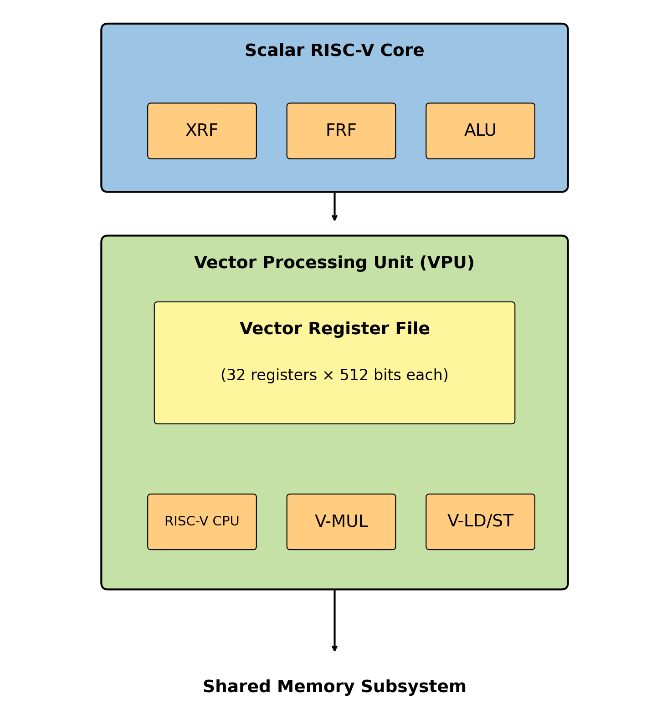
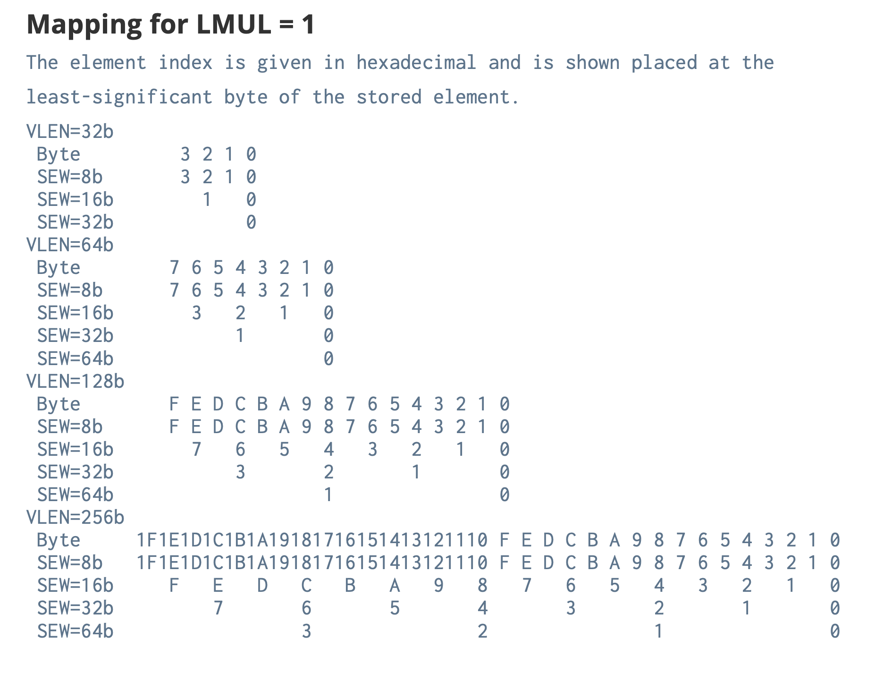
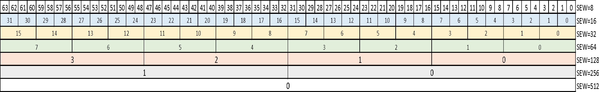
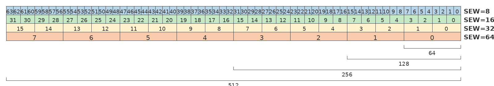
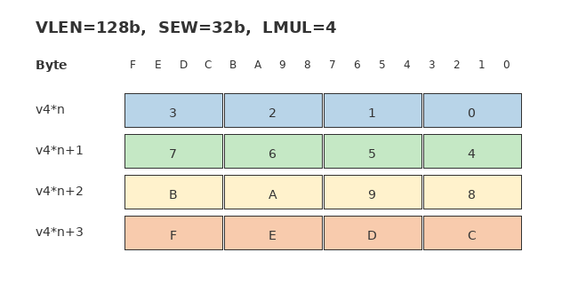
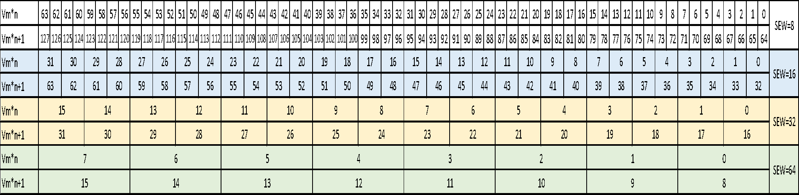
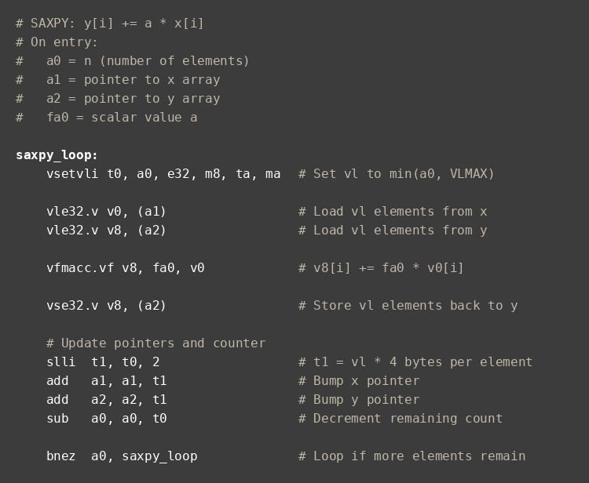

# Chapter 2: From Concept to Core — A RISC-V Vector Processor in Silicon

In Chapter 1, I built a conceptual foundation for RISC-V vectors: what distinguishes vector processors from fixed-width SIMD, why RVV is scalable, and how ideas like VLEN, SEW, LMUL, VL, masks, and chaining fit together.

In this chapter, I want to move one level closer to real hardware and show how those ideas look inside an actual implementation. I'll use the first RVV-based core—a 512-bit vector processor—as a running example.

I'll start by explaining the three key categories of parameters—configurable, extensible, and programmable—and finally walk through:

- How I structure the vector unit as a coprocessor
- How chaining and lanes work in real silicon
- Why a 512-bit vector register file is both powerful and challenging
- The microarchitectural tricks I use to avoid register-file port explosions and expensive renaming
- Where such a vector core really shines in practice

If Chapter 1 was about *why* vectors look the way they do, this chapter is about *how* you actually build one.

---

## 2.1 The RISC-V Ecosystem

In implementing a RISC-V vector processor, the goal was the following:

- A production-ready RVV core
- Configurable from small embedded designs to larger compute engines
- Competitive on performance, power, and area
- And, critically, aligned with a ratified RVV spec, not a private fork

The result was an RVV core, which—at 512-bit VLEN—has a vector register file roughly the same total width as the classic Cray-1 vector registers, but integrated into a modern 64-bit RISC-V CPU core.

---

## 2.2 Configurable, Extensible, Programmable: Three Axes of Flexibility

Before diving into the vector architecture, I want to clarify three words I use repeatedly:

1. Configurable
2. Extensible
3. Programmable

They sound similar, but they solve different problems.

### 2.2.1 Configurable (decided at build time)

"Configurable" parameters are chosen when you build or synthesize the core, and they do not change at runtime. Examples:

- L1 cache size (e.g., 32 KB vs. 64 KB)
- ECC/Parity/None for cache memories
- VLEN (e.g., 128-, 256-, or 512-bit vector registers)
- Decided on the supported SEW (allowed only half and single floating-point precision)
- Presence or absence of certain optional units (e.g., FPU) and instructions

Once you pick a configuration—say, VLEN = 512 bits, 32 KB L1—those settings become part of the microarchitecture of that particular core instance.

### 2.2.2 Extensible (ISA extensions, custom instructions)

"Extensible" refers to adding instructions to the base ISA:

- Standard extensions, like integer multiply/divide, FPU, DSP, or vector
- Custom instructions, often defined by the SoC or system company for special accelerators

RISC-V explicitly reserves opcode space for both standard and custom extensions. RVV itself is one such standard extension; your own tensor accelerator could be a custom extension.

### 2.2.3 Programmable (decided by software at runtime)

"Programmable" parameters are set by the running code. These include:

- **SEW (Selected Element Width):** 8, 16, 32, 64 bits (this could be configurable to remove units for larger sizes; the floating point units can add different sizes such as FP8 or BF16 as extensible instructions)
- **LMUL (register grouping)**
- **VL (vector length)**

These are configured through vector CSRs (like `vtype` and `vl`) and vector configuration instructions (like `vsetvl*`). They can change from loop to loop—even from block to block—without altering the underlying hardware.

The combination of SEW and LMUL determines VLMAX—the maximum number of elements that can be processed in a single vector instruction. The relationship is shown in the table below:

| vlmul[2:0] | LMUL | VLMAX | # Register Groups |
|------------|------|-------|-------------------|
| 101 | 1/8 | VLEN/(SEW×8) | 32 |
| 110 | 1/4 | VLEN/(SEW×4) | 32 |
| 111 | 1/2 | VLEN/(SEW×2) | 32 |
| 000 | 1 | VLEN/SEW | 32 |
| 001 | 2 | 2×VLEN/SEW | 16 |
| 010 | 4 | 4×VLEN/SEW | 8 |
| 011 | 8 | 8×VLEN/SEW | 4 |

**Figure 2-1.** VLMAX calculation for different LMUL settings. VLMAX = LMUL × VLEN / SEW represents the maximum number of elements that can be operated on with a single vector instruction. For the 512-bit implementation described in this chapter with SEW=32b: LMUL=1 gives VLMAX=16 elements, while LMUL=8 gives VLMAX=128 elements.

*Adapted from "RISC-V Vector Extension Specification, Version 1.0."*

RVV is powerful because it combines all three:

- Hardware designers choose **configurable** parameters like VLEN and lanes.
- ISA architects and system integrators decide **extensible** pieces like DSP, vector, and custom opcodes.
- Software chooses **programmable** vector parameters at runtime to match data shapes.

---

## 2.3 RISC-V and the Vector Extension in Context

RISC-V started at UC Berkeley as an open ISA designed to be simple, clean, and reusable. The foundation (now RISC-V International) formed in 2015 and quickly grew to hundreds of members worldwide.

From a hardware designer's perspective, I appreciate RISC-V's simplicity:

- All operands (integer registers x0–x31) are from the register file with the exception of load or store instructions
- Fixed locations for source and destination registers in the instruction, which makes it much simpler to decode instructions. The RISC-V ISA was created from a designer's point of view; for example, the operands must go through data dependency checking while the immediate has no data dependency, so the immediate data is fragmented in the instruction mnemonics
- No condition code register with sticky flags
- No predication baked into the scalar ISA
- No complicated "load multiple/store multiple" encodings (except for RVV)
- Fixed number of source and destination registers in the RISC-V ISA
- Limit the number of source operands and single destination operands for all instructions. In the RVV, it is necessary to have carry in/out instruction. Vector register 0 is used for both mask and carry-in, thus the number of source operands is the same. Carry-out is a destination register in addition to the result data register in which the carry-out instruction is duplicated into 2 instructions, one to write the result data into a destination vector register and one to execute the same instruction again to write to vector register 0 for carry out bits.
- Au contraire to the other views, the simplicity of the RISC-V ISA is a springboard to innovation of revolution of microarchitecture for microprocessor and vector processor.

The base ISA leaves opcode space reserved for extensions. RVV is one such extension, and it is one of the most important because it opens a path to efficient AI/ML, DSP, and other data-parallel workloads directly on RISC-V cores.

The vector extension was specified by a working group that iterated over several drafts (e.g., version 0.7) before the 1.0 spec stabilized. I started implementing vector hardware based on early drafts and updated the design as the spec converged toward 1.0.

By mid-2021, the RVV 1.0 spec was essentially stable and moving toward ratification. That timing mattered: I wanted a core that would ship against a ratified spec, not something that would immediately diverge—in which case the custom extensible instruction should be used.

---

## 2.4 SIMD Lineage and Lessons for Vectors

In Chapter 1, I compared classic SIMD to vector processors and showed how binding width into the ISA leads to complexity.

Here I'll be a bit more concrete, because the vector design explicitly avoids those historical pitfalls. See Chapter 1, section 1.9 "From MMX to AVX-512: A Brief History Lesson."

At each step, new instructions and encodings were added. The cost of supporting all generations was high—for hardware, compilers, and binary compatibility.

RVV deliberately did not follow this path. Instead of adding new instructions for each wider register file, we:

- Fix the instruction semantics in the ISA
- Make VLEN (hardware width) a configuration choice
- Make SEW, LMUL, and VL programmable at runtime
- Use a small number of vector CSRs to let software query and adapt to the implementation

The result is a vector ISA that can scale from narrow cores to very wide engines with power that scales incrementally with VLEN without creating new instruction sets at each width.

---

## 2.5 Vector Extension as a Coprocessor

RVV is an extension of the base RISC-V ISA, not a standalone processor. In a typical design, including mine, you can think of the vector unit as a coprocessor attached to a scalar RISC-V core.

At a high level, the core looks like this:

**Scalar CPU:**
- 32/64-bit integer register file (XRF)
- Optional scalar floating-point register file (FRF)
- Integer functional units, branch, and load/store units
- Optional FP functional units

**Vector Processing Unit (VPU):**
- Vector register file (VRF): 32 registers, each VLEN bits wide (e.g., 512 bits)
- Vector integer functional units, vector floating-point functional units
- Vector permutation functional units
- Vector mask functional units
- Vector load/store unit(s) with support for unit-stride, strided, and indexed accesses
- Control logic to schedule and chain vector instructions



**Figure 2-2.** High-level architecture of a RISC-V vector processor. The Vector Processing Unit (VPU) operates as a coprocessor alongside the scalar core, with its own 512-bit register file and functional units. Both units share the memory system but probably through different hierarchies of the cache memories since vector and scalar have different requirements for data size and different memory regions.

*Adapted from "RISC-V Vector Extension Specification, Version 1.0."*

The scalar core issues vector instructions to the VPU in which the VPU decodes and executes using its own pipelines and register file. The scalar and vector units share the memory system, but otherwise the vector state (VRF, vector CSRs) is separate.

A key design rule: the vector co-processor unit's VLEN must be at least as wide as the underlying SIMD width of the datapaths implementing the micro-ops. In my implementation, I chose VLEN = 512 bits, but I also support narrower (128- and 256-bit) and wider (1024- and 2048-bit) configurations.

---

## 2.6 Chaining and Lanes in Real Hardware

In Chapter 1, I described chaining as the ability of a vector processor to start using partial results from an instruction as soon as they are ready, without waiting for the entire vector to complete.

Now let's look at how I make that practical.

### 2.6.1 Lanes: localizing data and timing

To reach reasonable clock frequencies with 512-bit registers, I partitioned the VPU into lanes. For example:

- 512-bit VLEN
- 4 lanes
- Each lane holds 128 bits of each vector register element slice

Each lane has:

- Local slices of 128-bits of the VRF
- Functional units that can operate on SEW elements in 128-bit data path:
  - A set of ALUs
  - A set of multipliers
  - A set of dividers
  - A set of FPUs
- Read/write 128 bits from the load/store path

This keeps wires short and timing paths local. Data movement stays inside the lane as much as possible.







**Figure 2-3.** Element packing in vector registers for LMUL=1 at VLEN=64b, 128b, 256b, and 512b. Each row shows how elements of different widths (SEW) are packed into register bytes.

*Adapted from "RISC-V Vector Extension Specification, Version 1.0," Section 5.1, RISC-V International, licensed under CC-BY 4.0.*

The element numbers (0, 1, 2, etc.) shown in each row indicate which element occupies those byte positions. Empty cells indicate bytes that are part of multi-byte elements. For example, with SEW=16b, element 0 occupies bytes 0-1, element 1 occupies bytes 2-3, etc.

### 2.6.2 Chaining through partial results

Suppose a vector instruction operates on 32 elements and I have 8 lanes:

- Each cycle, each lane processes one element
- After 4 cycles, all 32 elements for that instruction have been touched once

Now imagine a sequence: VLOAD → VMUL → VADD. With chaining:

1. As soon as the first 8 elements are loaded (one per lane), those partial results can flow directly into the multiply units.
2. Once the first 8 multiply results are ready, they can start flowing into the add units.
3. The rest of the elements follow behind in a kind of vector "pipeline."
4. In steady state, the above sequence produces 8 elements result per clock cycle.

Instead of treating each vector instruction as a monolithic task that must fully complete before the next begins—which would leave a four‑cycle bubble in every steady‑state iteration—I treat it as a streaming pipeline of micro-ops. Partial results are forwarded as soon as they are valid, effectively quadrupling performance.

In comparison to SIMD, where there is no LMUL, the SIMD instructions must be in a 4-iteration loop. The SIMD can be pipelined from VLOAD → VMUL → VADD, but will have bubbles to process the loop overhead instruction and 4 VLOAD instructions which is very inefficient.

If VLEN were always equal to the per-cycle SIMD width, you would just have a fixed-width SIMD engine, not a vector processor. What makes this a vector processor is precisely that:

- A single vector instruction spans multiple cycles,
- Its execution is broken into chunks, and
- Those chunks can be chained into dependent instructions as they progress.
- The LMUL of the RVV is programmable allowing balancing of the number of vector registers and complexity of task.
- ARM SVE fixes the relationship between architectural vector length and execution granularity, whereas RVV exposes LMUL as a programmable parameter. In practice, this means RVV allows software to trade register grouping against parallelism explicitly, while SVE keeps this relationship implicit and fixed by the architecture.
- So far, we have been discussing designs where the internal datapath width (DLEN) is the same size as VLEN, meaning that a vector operates on 512 bits per cycle. RVV, however, allows an implementation to use an internal datapath narrower than VLEN—for example, half or a quarter the width. As with ARM SVE, such an implementation internally behaves as if LMUL were scaled by the ratio of VLEN to the internal datapath width (DLEN), even though this behavior is entirely microarchitectural and not visible to software. For example, if DLEN = 256 bits, execution behaves as if LMUL values of 2, 4, 8, and 16 were used internally.

---

## 2.7 A Historical Comparison: Cray-1 vs. RVV

The Cray-1 (1970s) is a classic vector machine with:

- 8 vector registers
- 64 elements per register
- 64-bit element width

Each vector register is therefore:

64 elements × 64 bits = 4096 bits

The RVV implementation with:

- 32 vector registers
- 512-bit VLEN
- LMUL up to 8

can form logical vector groups that are also 4096 bits wide (512 × 8), giving a similar total width to the Cray-1, but:

- In a modern 64-bit RISC-V core
- With coherent caches instead of hand-tuned multi-bank main memory
- In process nodes like 12 nm, 7 nm, 5 nm, not 1970s technology

Figure 2-3 showed how elements pack within a single vector register (LMUL=1). Now let's see what happens when we group multiple registers together. Figure 2-4 illustrates LMUL=4, where four consecutive registers form a single logical vector. Notice that the element numbering convention remains the same—element 0 is always at the least significant byte position—but the element indices now span across all registers in the group.





**Figure 2-4.** Register grouping for LMUL=4 showing how elements are packed across four 128-bit registers. In the 512-bit implementation described in this chapter, similar grouping with LMUL=8 allows eight 512-bit registers to function as a single 4096-bit logical vector, matching the capacity of classic vector machines like the Cray-1.

*Adapted from "RISC-V Vector Extension Specification, Version 1.0," Section 5.3, RISC-V International, licensed under CC-BY 4.0.*

RISC-V also supports fractional LMUL values (1/2, 1/4, 1/8) for handling mixed-width operations efficiently. When LMUL<1, only a portion of each vector register is used for active elements, with the remainder treated as tail elements. This flexibility allows narrow data types to coexist with wide data types in the same loop without wasting register resources. For fractional LMUL, the clock and power to the unused lanes can be powered off to save power.


**Figure 2-5.** Fractional LMUL example (LMUL=1/4, VLEN=128b). With LMUL=1/4 and SEW=8b, only 4 elements (bytes 0-3) are active; the remaining bytes are tail elements (shown as dashes). This allows efficient use of vector registers when processing mixed-width data.

*Adapted from "RISC-V Vector Extension Specification, Version 1.0," Section 5.2, RISC-V International, licensed under CC-BY 4.0.*

---

## 2.8 Vectorizing Loops: A Concrete Example

Let me revisit the simple loop from Chapter 1, but now in the context of a real RVV implementation.

I have:

```c
for (int i = 0; i < N; i++) {
    y[i] += a * x[i];
}
```

On a scalar core, that means:

- One load of x[i] per iteration
- One multiply by a
- One load of y[i]
- One add
- One store of y[i]
- Loop overhead (increment i, compare, branch)

For N = 64, that yields hundreds of dynamic scalar instructions.

On a vector core with VLEN and SEW chosen such that I can process 64 elements at once, I can:

- Configure VL = 64
- Set up vector registers for x, y, and (broadcast) a
- Issue:
  - VLOAD of 64 elements from x
  - VMUL by scalar a
  - VLOAD of 64 elements from y
  - VADD
  - VSTORE back to y

Roughly five or six vector instructions do the work of hundreds of scalar instructions. With chaining, the effective pipeline executes these as a stream of operations over chunks of the vector.

Here is the actual RISC-V vector assembly for this SAXPY loop:



**Figure 2-6.** Strip-mining example showing actual RISC-V vector assembly code for the SAXPY loop (y[i] += a * x[i]). The `vsetvli` instruction dynamically sets `vl` based on the remaining element count, and the loop continues until all elements are processed. This code works correctly regardless of the hardware's VLEN, making it portable across different vector implementations.

*Adapted strip-mining pattern from "RISC-V Vector Extension Specification, Version 1.0," Section 7.4, RISC-V International, licensed under CC-BY 4.0.*

---

## 2.9 Technical Challenges of a 512-bit VRF

So far, vectors can sound almost too good to be true. The real difficulty emerges when you try to implement a wide vector register file (VRF) and keep multiple functional units fed without exploding area or power.

At the hardware level, every bit of every vector register requires N read ports and M write ports, all routed to multiple functional units. In advanced process nodes, the physical width of a vector register is dictated largely by the layout footprint of these ports. In practice, the VRF's read and write ports—not the ALUs themselves—become the dominant limiting factor in a vector processor.

Ideally, you would instantiate as many arithmetic units as possible, since more units allow more vector operations to execute concurrently. In reality, however, the number of functional units you can support is capped by how many read and write ports you can physically route into the VRF.

The optimal number of VRF ports is therefore determined by the most important application kernels. These kernels should execute without bubbles. To determine the required port count, you can manually pipeline a kernel's instructions under the assumption of unlimited VRF bandwidth. By then slicing that idealized pipeline across time, you can derive the minimum number of read and write ports needed to sustain bubble-free execution with the best power, performance, and area (PPA). Repeating this process across other key kernels allows you to converge on a balanced, application-driven port configuration.

With a configuration such as VLEN = 512 bits, 32 vector registers, and several functional units, the VRF must:

- Read many bits per cycle for multiple source operands
- Write many bits per cycle for multiple results
- Handle accesses from several independent pipelines (ALU, multiplier, load/store, and others)

Every read or write port on a wide register file:

- Consumes silicon area
- Adds capacitance and power
- Makes timing closure more difficult

You cannot simply give each functional unit its own private set of full-width VRF ports; such a design would be prohibitively large and slow. Instead, the architecture must:

- Limit the number of ports
- Share ports across functional units
- Carefully schedule access to avoid conflicts

Another layer of complexity arises from out-of-order execution and retirement. Traditional out-of-order cores rely on register renaming and a reorder buffer (ROB). Extending this model naively to 512-bit vector registers multiplies storage requirements: each in-flight instruction may need space to hold a full 512-bit result, and a ROB tracking 128–256 in-flight vector instructions quickly becomes enormous.

On top of this, implementing precise exceptions for long-running vector operations is difficult. If an interrupt occurs in the middle of a long vector instruction, the processor must define what the architectural state means at that point and potentially replay partial work. For general-purpose CPUs and smartphones, precise exceptions are essential. For many AI and embedded workloads, they matter less, which provides additional freedom to trade architectural complexity for improved performance and area efficiency.

---

## 2.10 My Approach: High Performance Without Renaming

When I designed the first 512-bit vector processor, I wanted:

- A high-performance core with RVV support—often requiring out-of-order execution
- Good utilization of functional units
- Limited register-file port count
- But no massive renaming structures and no huge ROB of 512-bit entries

The solution was a combination of:

1. A carefully designed port-sharing algorithm for the VRF
2. A scheduling scheme that guarantees any instruction entering a given functional unit has the read and write ports it needs when it needs them
3. A form of out-of-order execution and retirement that does not require full register renaming for the vector registers

In practice, this means:

- I can have multiple functional units (ALU, multiplier, load/store, others) accessing the VRF, but I orchestrate access so that read and write-back conflicts do not cause stalls.
- "Fire-and-forget" microarchitecture where I avoid situations where a completed vector operation has to "wait" with its entire 512-bit result in a temporary buffer because the VRF write ports are busy.
- I dramatically reduce the number of large buffers that would otherwise exist solely to handle back-pressure from port conflicts.

By never allowing port conflicts to stall completed operations, I avoid the domino effect where:

- A 512-bit result waits for a write port
- That wait stalls earlier pipeline stages
- Those stages, in turn, stall other operations
- And everything backs up

Instead, I ensure that:

- When a vector instruction is scheduled into a functional unit, its VRF access ports are already reserved.
- This makes execution more predictable and keeps real-time behavior saner for embedded applications.

I also chose not to implement full vector register renaming. That might sound limiting, but in practice, for a 512-bit vector core targeting AI and embedded workloads, it was a very good trade-off between performance, silicon cost, and design complexity.

---

## 2.11 A Concrete RISC-V Vector Core

Let me briefly summarize how these ideas show up in a specific core.

The RVV is built around a 64-bit scalar architecture (an in-order, five-stage pipeline) with:

- **Optional branch prediction** — it is a must for high performance. The vector kernel is most like a loop with many iterations, the branch prediction is a must to predict a loop and implement a loop buffer in the design. This is the distinction between DSP and general-purpose CPU
- Instruction and data caches
- Integer multiply/divide
- Floating-point unit (FPU)
- Vector Processing Unit (VPU) attached as a coprocessor

The VPU:

- Implements RVV with configurable VLEN (128, 256, 512, 1024, or 2048 bits—Simplex Micro implementation)
- Supports non-blocking vector load/store operations through the cache and beyond
- Provides a custom access path to local memory via an CHI (Coherent Hub Interface—scalable, coherent, and high-performance interconnects) or streaming interface
- Includes a custom instruction mechanism to efficiently fetch data from either L2 cache or local vector memory (streaming interface) while preserving the semantics of standard RVV load/store instructions

The vector load/store unit supports:

- Unit-stride accesses
- Stride accesses
- Index accesses

and is designed to:

- Interleave and parallel memory banks
- Exploit multiple outstanding requests
- Provide sufficient bandwidth to keep the vector pipelines fed

Configuration options include:

- VLEN = 128, 256, or 512 bits (typical commercial configurations)
- Different burst sizes and memory interface parameters

This makes the core adaptable to different markets:

- Embedded vision and ML at the edge
- Mid-range compute in networking or storage
- Higher-performance data-center accelerators when integrated into larger SoCs

All of this is wrapped in the RVV programming model from Chapter 1: you still have the same `vtype`, `vl`, and vector instruction semantics. The hardware details change; the ISA contract does not.

---

## 2.12 Where a Vector Processor Shines

A modern RISC-V vector processor is most valuable when you have:

- Data-parallel workloads requiring the same operation across many elements
- Moderate to high memory bandwidth
- Tolerance for slightly more complex hardware in exchange for dramatically lower instruction counts

Typical applications include:

- Scientific computing and engineering simulations
- Multimedia and image processing
- AI and machine learning inference
- Compression and cryptography
- Speech, handwriting, and language processing
- Networking, database primitives, and OS kernels that operate on large data buffers

In many of these domains, vectors offer a "middle ground" between:

- Pure scalar execution (simple, but inefficient for large datasets)
- Offloading everything to a GPU (powerful but with higher software overhead and different programming models)

RVV-style vectors let you stay in the CPU world while still exploiting substantial data parallelism. In a way, the media application processing kernels are vectorizing:

| Kernel | Vector Length |
|--------|---------------|
| Matrix transpose/multiplication | # vertices at once |
| DCT (video, communication) | image width |
| FFT (audio) | 256-1024b |
| Motion estimation (video) | image width, iw/16 |
| Gamma correction (video) | image width |
| Haar transform (media mining) | image width |
| Median filter (image processing) | image width |
| Separable convolution (image processing) | image width |

---

## 2.13 What Comes Next

In this chapter, I showed how the conceptual ideas from Chapter 1 map into a real RVV implementation:

- How a vector processor appears as a coprocessor alongside a scalar RISC-V core
- How lanes and chaining turn vector instructions into streaming pipelines
- Why wide VRFs create design challenges, and how I mitigate them
- How a concrete design realizes RVV in silicon

In the next chapter, I'll move from the hardware structure to the software interface:

- The vector control and status registers (`vtype`, `vl`, `vstart`)
- How `vsetvl` and its variants work in real code
- How I write vectorized loops in C and assembly using strip mining
- How masking and VL interact to handle tails, conditional operations, and irregular data shapes

By the end of that chapter, you'll have a much clearer sense of how to program the kind of RVV core I've just described—and how to read the compiler-generated vector code your toolchain produces.
