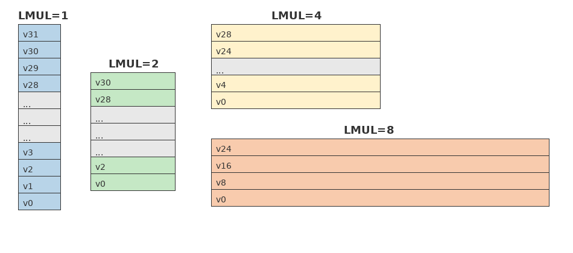
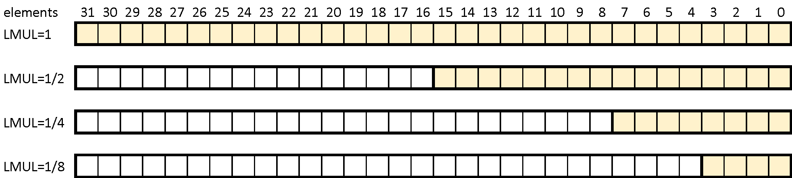
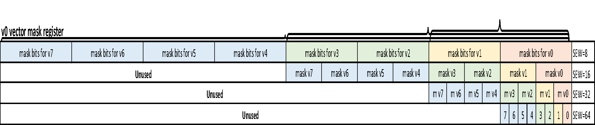
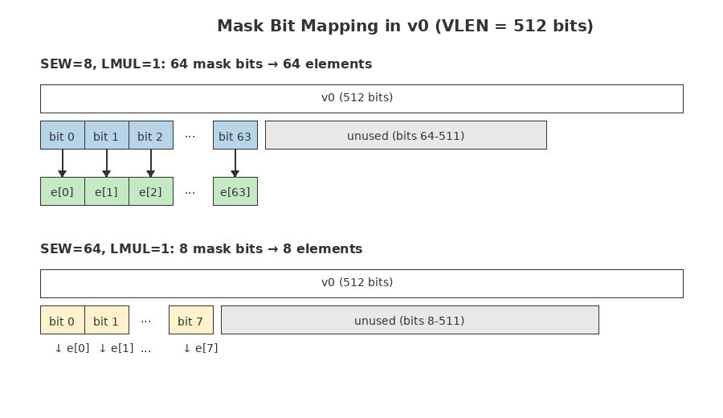
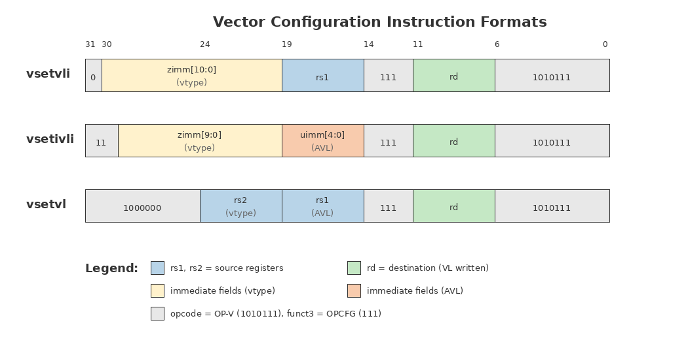
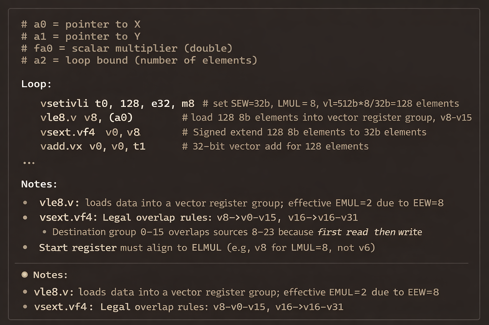
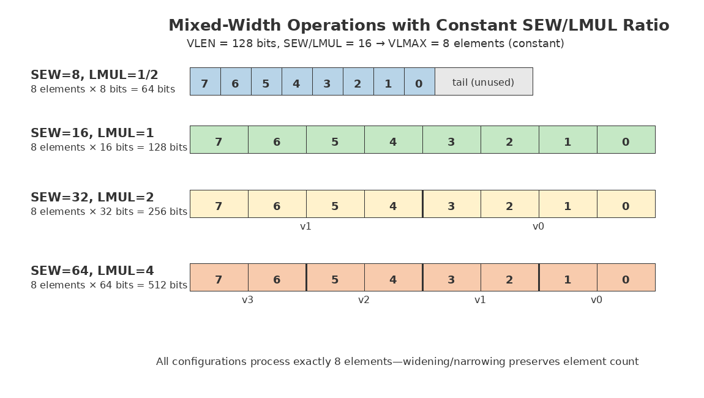
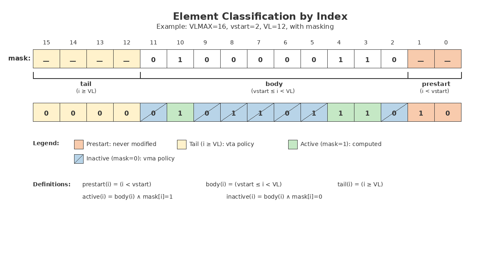

# Chapter 3: RISC-V Vector Extension Fundamentals

Before diving into the architectural details of vector processor implementation, we must first understand the fundamental concepts that define the RISC-V Vector Extension ISA. These concepts—element width, vector length, register grouping, and masking—form the vocabulary that architects and programmers use to reason about vector computation. Getting these basics right is essential, because every design decision in a vector processor ultimately traces back to how these parameters interact.

---

## 3.1 The Register-Centric Execution Model

The RISC-V Vector Extension follows a strictly register-centric execution model. All vector operations execute between vector registers, with only load and store instructions accessing memory. This is the foundation of the RISC philosophy: only load/store instructions touch memory; everything else operates on registers.

This stands in contrast to some other vector memory ISAs where vector operations can directly access data memory. The register-centric approach offers a clean separation of concerns: the memory system handles data movement, while the functional units focus purely on computation. This separation simplifies both hardware design and software reasoning about performance.

The basic requirement is straightforward: vector data consists of N elements, each M bits wide. The element width M must be a power of two, and the total vector register length is simply N × M. These constraints enable efficient hardware implementation and leave both N and M flexible through the SEW (Selected Element Width) and LMUL (Length Multiplier) parameters.

---

## 3.2 Core Parameters and Terminology

Understanding the RISC-V Vector Extension (RVV) requires familiarity with several key parameters that appear throughout the specification and implementation. These terms recur constantly in vector programming and hardware design, so precise understanding is essential. They determine the register layout, element count, memory behavior, and microarchitectural decomposition of instructions.

**SEW (Standard Element Width)** specifies the width of a single vector element in bits. The supported values are 8, 16, 32, and 64 bits—all powers of two. RVV ISA specifications reserve additional encodings for larger widths like 128 bits, though this remains uncommon.

**VLEN (Vector Register Length)** defines the width of a single vector register in bits. This is a design-time constant fixed at implementation. A common implementation choice is VLEN equal to 512 bits, though 1024, 256 and 128 bits are also widely supported. Throughout this chapter, we use 512 bits as the running example.

**VLMAX (Maximum Vector Length)** defines the hardware capacity: the maximum number of elements a vector register group can hold, calculated as VLEN ÷ SEW and scaled by LMUL.

**LMUL** controls register grouping, allowing multiple architectural registers to be treated as a single logical register. This mechanism dramatically extends the effective vector length without requiring wider physical registers.

One important concept in RVV is that the number of defined elements is set by the VLEN, LMUL, and SEW for all vector instructions. For example, the program can set LMUL=4, SEW=32-bit, thus the number of elements is 512/32×4 = 64. The vector load instructions can be for 8-bit in which case the vector load instruction is for a single vector register where 512-bit/8-bit = 64 elements. The vector load instruction can be programmed to be 8, 16, 32, or 64-bit, and the hardware must load 64 elements into vector registers. The RVV ISA includes instructions to extend or to reduce the width of the elements, the element width can be extended to 0.5×, 2×, 4×, or 8×, but the number of elements will be 64 elements. The number of vector registers per instruction is limited to 8 vector registers, the extended width cannot use more than 8 vector registers in which the illegal instruction is asserted. In this example, the instruction with the width extension of 8× is illegal instruction.

**VL (Vector Length)** defines the software usage: the actual number of elements a program chooses to operate on, which can range from 0 up to VLMAX. This separation between capacity and usage allows efficient handling of data sets that don't align with hardware width. If the programmer attempts to set the VL greater than VLMAX, then the hardware will default VL to be VLMAX.

---

## 3.3 Functional Unit Organization

A vector processor comprises both scalar and vector functional units. Scalar execution proceeds as in standard RV64 or RV32, while the vector side consists of:

- **Vector Arithmetic Logical Units (VALUs)**
- **Vector Floating-Point Units (VFPUs)**
- **Vector Instruction Permutation (VIPER)**
- **Mask logic (VMSK)**
- **Vector Load Store Unit (VLSU)**

Many implementations support multiple concurrent loads/stores to hide memory latency and sustain bandwidth.

The scalar side follows the standard RISC-V ISA with integer and floating-point support. The vector side provides a complete set of supports for integer, fixed point, floating-point, and conversion operations. Element widths span from 8 to 64 bits, and operations can occur between vector-vector, vector-scalar, or vector-immediate operands. Since the vector instructions are for many elements, the vector side also supports permutation and mask operations.

The vector memory unit handles load/store operations in three fundamental patterns: unit-stride (contiguous elements), strided (constant offset between elements), and indexed (gather/scatter with per-element addresses). Segment load/store operations extend these patterns for structure-of-arrays data layouts.

High-performance implementations can support multiple concurrent load/store operations from different memory types: cache, non-cached memory, and local vector memory. All read and write ports to the register file are typically centrally controlled, with data dependencies managed by a scoreboard.

### 3.3.1 The Coupling Challenge

One important implementation consideration is the coupling between the vector processor and the scalar CPU. Decoupling them is surprisingly difficult because vector instructions frequently reference the integer register file—both for reading scalar operands and for computing memory addresses. In addition, the scalar CPU handles all the control and status registers (CSRs) including the vector CSRs. The CSR operation is often serialized instruction which can be a major degradation for performance. Some vector CSRs must be updated speculatively for performance. This tight integration requires careful coordination between the two domains. In practice, achieving clean decoupling requires substantial engineering effort and is not always the right design choice.

Ideally, the memory regions for scalar and vector should be separated for optimal performance, but the hardware must check for any memory address dependency between the scalar and vector load/store operations. This is the complexity in implementation of the load store unit to ensure that memory data dependency is properly handled if it existed.

The flip side of tight coupling is flexibility: the functional unit design can be highly modular. If workloads demand heavy floating-point MAC throughput, the floating-point MAC unit can be duplicated. Custom functional units or hardware accelerators can be added to the vector execution pipeline, extending capability without fundamental architectural changes.

While functional units determine peak arithmetic throughput, the vector register file ultimately governs how quickly data can be delivered to these units. The next subsection examines this critical but often overlooked component in detail.

### 3.3.2 Register File Banking, Ports, and Conflicts

The previous section outlined how vector functional units interact with each other and with the scalar pipeline. We now turn to a deeper layer: the physical organization of the vector register file (VRF). While software presents 32 architectural registers of VLEN bits each, the hardware must carefully balance area, power, latency, and bandwidth. These implementation constraints directly influence how LMUL, widening, masking, and permutation instructions behave in practice.

#### 3.3.2.1 Banking and Porting Basics

A monolithic VLEN-bit multiported register file is impractical in area and power. Instead, vector processors distribute storage across multiple SRAM banks, each with a small number of read and write ports. This is achieved through:

- **Banking:** Registers are divided among independent banks, either by bits (bit-slicing) or by register number (register-slicing).
- **Time-multiplexing:** Reads and writes are scheduled across multiple pipeline phases to avoid exceeding the port limits of each bank.
- **Pattern awareness:** Unit-stride and constant-stride loads and stores map predictably across banks, minimizing conflicts.

From software's perspective, LMUL determines how many architectural registers form a logical vector group. From hardware's perspective, the logical vector group is broken into micro-ops where the micro-ops is limited to read or write of a single vector register, allowing the VRF to provide limited ports per cycle while still sustaining high throughput.

Implementers often determine VRF port counts empirically by running application workloads and measuring when port conflicts limit throughput. Ports are then increased until these benchmarks achieve the desired performance. The application kernels often use vector group (LMUL greater than 1). This avoids over-provisioning while ensuring the VRF meets real-world performance requirements.

Typical microarchitectures provide:

- 2–3 read ports (two sources plus optional mask read from v0)
- 1 write port
- Optional auxiliary bandwidth for widening or for multiple functional units operating in parallel

Because port count does not scale with LMUL, larger LMUL values are handled by splitting instructions into multiple micro-ops, each respecting the same fixed port budget.

#### 3.3.2.2 LMUL, Widening, Narrowing, and Bandwidth Scaling

LMUL determines how many physical registers are consumed per logical vector:

- **LMUL=1:** Each source or destination operand of a micro-op accesses one register.
- **LMUL>1:** Instructions expand into multiple micro-ops of LMUL=1 micro-op.
- **Fractional LMUL:** Reduces the number of active elements, leaving space for widening while lowering VRF bandwidth pressure.

Widening instructions (e.g., `vwadd`, `vwmul`, `vwsub`) produce results twice as wide as their inputs. Rather than doubling VRF ports, implementations:

- Split widening results into two write cycles
- Generate independent micro-ops for the low and high halves, or
- Use a dedicated widening pipeline with buffered writeback

Narrowing instructions (e.g., `vnsr`, `vnclip`, `vfncvt`) produce results half the width of their inputs:

- Use a dedicated narrowing pipeline with buffer writeback

This preserves timing closure and power efficiency while supporting mixed-precision patterns such as int8 → int16 or fp16 → fp32 or int16 → int8 or fp32 → fp16.

As noted earlier, the number of elements per programming of LMUL and SEW should be the same for all vector instructions. Widening instructions, narrowing instructions, and fixed element-width vector load/store instructions effectively change the effective LMUL (ELMUL) or effective (ESEW). Widening instruction effectively changes the ELMUL to be 2× of LMUL, thus if LMUL=8, the widening instructions are illegal.

#### 3.3.2.3 Indexed Accesses and Bank Conflicts

Unit-stride loads and stores distribute accesses evenly across banks, allowing near-ideal bandwidth. Indexed patterns—gather and scatter—lack this regularity. Adjacent elements may request the same bank in the same cycle, forcing replays or serialization or multi-cycle operations.

Common microarchitectural techniques include:

- Bank interleaving to spread addresses across banks for many common strides, where multiple banks can be read at the same time
- Replay queues that reissue conflicted accesses without stalling the pipeline
- Lower peak throughput for indexed operations relative to unit-stride loads/stores
- Strictly use unit vector loads and use of `vrgather`, `slideup`, `slidedown`, and `compress` to rearrange data *inside* the VRF
- Similar to the VRF where the number vector register grouping is limited to 8, the number of cache lines per vector load/store instruction can also be limited

In practice, compilers try to minimize irregular memory access. They often load data with unit-stride instructions and use vector permutes to achieve the required ordering.

#### 3.3.2.4 Interaction with Chaining and Masking

Chaining, discussed in Section 3.9, allows dependent vector operations to overlap when VRF ports are sufficient. This works only when the VRF can supply the required operands without exceeding port limits. When several functional units are active—such as fused multiply-add, widening, and reduction units—VRF read pressure increases. Chaining should be taken into account for important application kernels in setting the number of VRF read and write ports.

Masking influences VRF efficiency:

- **Agnostic policies (vma/vta)** allow masked-off elements to be ignored, eliminating unnecessary reads of "old" data.
- **Undisturbed policies (vum/vtu)** may require reading the previous value to preserve inactive elements, increasing port usage.
- Designs without register renaming often implement both policies identically for simplicity, but high-performance implementations using register renaming distinguish them microarchitecturally.

Chaining thus depends on a balance of port availability, micro-op scheduling, and masking behavior. A well-designed VRF allows a continuous stream of dependent vector operations without stalling. With the physical constraints of the register file in mind, we now turn to the architectural controls that govern vector behavior: the Control and Status Registers (CSRs). These define how SEW, LMUL, VL, masking, and tail policies are communicated to the hardware.

---

## 3.4 Control and Status Registers

The vector extension introduces several Control and Status Registers (CSRs) that define how vector instructions execute. These fall into two groups: arithmetic CSRs, which manage saturation flags and rounding modes, and configuration CSRs, which set parameters such as VL and vtype. Correctly understanding their update timing and semantics is essential for both software correctness and hardware implementation.

CSR manipulation governs how vector instructions interpret SEW, LMUL, masks, and other configuration settings. The two primary CSRs are:

- **VL** — the active vector length
- **vtype** — encodes SEW, LMUL, mask/tail policy

Speculative CSR handling ensures that `vsetvl` instructions do not serialize the pipeline. The programmer should limit the use of `vsetvl` instructions to avoid serialization of instruction issuing.

### 3.4.1 Arithmetic Control

Fixed-point saturation and floating-point rounding reuse scalar CSRs. The vector unit must integrate cleanly with the scalar FPU to ensure compatibility with existing RISC-V software ecosystems. Fixed-point operations use dedicated CSRs for saturation flags and rounding mode control. These can be implemented as separate registers or merged into a single register for convenience. For floating-point operations, the vector processor shares the standard floating-point CSR (`fcsr`) with the scalar FPU, including its flags and rounding mode settings. This sharing simplifies the programming model but requires careful implementation to avoid conflicts or creating artificial data dependencies.

#### 3.4.1.1 CPU Ownership of Vector State

A key architectural principle is that the scalar CPU, not the VPU, owns all vector programmable state. The CPU computes and attaches the effective SEW, LMUL, VL, mask policy, and vstart to the vector instructions before they are executed in the VPU. Furthermore, the scalar CPU detects illegal vector instructions and takes traps such that the VPU receives only valid vector instructions.

This design:

- Greatly simplifies VPU implementation
- Avoids speculative state tracking inside the VPU
- Ensures all instructions arrive with fully resolved vector states
- Enables rapid development cycles because the complexity of vector states stays centralized in the CPU

By keeping the VPU "stateless" regarding configuration transitions, vector engines remain predictable, scalable, and easier to verify.

The VPU performance, in most cases, determined by the vector load/store operations which should be executed speculatively based on the speculative vector states.

### 3.4.2 Vector Configuration (Speculative Handling)

The VL and vtype registers present a unique implementation challenge. In typical CSR implementations, writes are serializing events—the pipeline must drain before the new value takes effect. This approach would be catastrophically slow for vector code, where VL and vtype change frequently throughout execution.

The solution is speculative CSR handling. Speculative propagation ensures performance remains high even with frequent configuration changes. Vector instructions do not read from the committed CSR values; instead, they use speculative copies based on preceding `vsetvl` instructions. This allows VL and vtype updates to be treated as normal instructions rather than serializing barriers, maintaining pipeline efficiency. The hardware must track these speculative values through the pipeline and handle misprediction recovery, but the performance benefit justifies the complexity.

---

## 3.5 The vtype Register

The vtype register encodes the vector type configuration, including LMUL, SEW, and policies for handling masked and tail elements. This single register controls how the hardware interprets vector instructions, making it the most frequently referenced configuration state. RVV compresses this flexibility into a compact 3-bit LMUL encoding.

**Figure 3-1. vtype Register Layout**

| Bits | Name | Description |
|------|------|-------------|
| XLEN-1 | vill | Illegal value if set |
| XLEN-2:8 | 0 | Reserved (must be zero) |
| 7 | vma | Vector mask agnostic |
| 6 | vta | Vector tail agnostic |
| 5:3 | vsew[2:0] | Selected element width (SEW) setting |
| 2:0 | vlmul[2:0] | Vector register group multiplier (LMUL) setting |

Layout of the vtype register showing the five fields that control vector instruction behavior. The vill bit (at position XLEN-1) signals an illegal configuration; vma and vta control the handling of masked and tail elements; vsew encodes the standard element width; and vlmul encodes the register grouping multiplier. Bits XLEN-2 through 8 are reserved and should be written as zeros. This layout is for RV32; on RV64, vill remains at bit 63 with additional reserved bits.

*Adapted from "RISC-V Vector Extension Specification, Version 1.0," Section 3.4, RISC-V International, licensed under CC-BY 4.0.*

### 3.5.1 LMUL Encoding

The vlmul field uses a 3-bit encoding to represent both integer and fractional multipliers. Vector register group multiplier (LMUL) encoding in the vlmul[2:0] field of vtype. Fractional values (1/8, 1/4, 1/2) reduce the effective vector length while preserving all 32 architectural register names; integer values (2, 4, 8) group adjacent registers to extend vector length at the cost of fewer addressable register groups.

**Figure 3-2. vlmul Field Encoding**

| vlmul[2:0] | LMUL | VLMAX | # Registers |
|------------|------|-------|-------------|
| 101 | 1/8 | VLEN/(SEW×8) | 32 |
| 110 | 1/4 | VLEN/(SEW×4) | 32 |
| 111 | 1/2 | VLEN/(SEW×2) | 32 |
| 000 | 1 | VLEN/SEW | 32 |
| 001 | 2 | 2×VLEN/SEW | 16 |
| 010 | 4 | 4×VLEN/SEW | 8 |
| 011 | 8 | 8×VLEN/SEW | 4 |

The encoding reveals an elegant design: fractional multipliers (1/8, 1/4, 1/2) use the upper bit patterns, while integer multipliers (1, 2, 4, 8) use the lower patterns. This allows a single 3-bit field to span a 64× range of effective vector lengths.

### 3.5.2 Tail and Mask Agnostic Policies

The vta (vector tail agnostic) and vma (vector mask agnostic) bits control what happens to elements that are either beyond VL (tail elements) or masked off. The vta and vma fields determine how inactive elements are produced. Out-of-order designs with register renaming benefit from "agnostic" policies. Designs without renaming often treat undisturbed and agnostic identically.

The specification allows two policies: undisturbed (preserve previous values) or agnostic (implementation may write any value).

**Figure 3-3. vta/vma Policy Table**

| vta | vma | Tail Elements | Masked Elements |
|-----|-----|---------------|-----------------|
| 0 | 0 | Undisturbed | Undisturbed |
| 0 | 1 | Undisturbed | Agnostic |
| 1 | 0 | Agnostic | Undisturbed |
| 1 | 1 | Agnostic | Agnostic |

*Adapted from "RISC-V Vector Extension Specification, Version 1.0," Section 3.4, RISC-V International, licensed under CC-BY 4.0.*

Tail and mask agnostic policy encoding. The vta bit (position 6) controls tail element handling; the vma bit (position 7) controls masked element handling. When set to 0 (undisturbed), inactive elements retain their previous values. When set to 1 (agnostic), the implementation may overwrite inactive elements with arbitrary values, enabling optimizations in register-renaming microarchitectures.

The motivation for agnostic policies relates to out-of-order execution with register renaming. When a vector register is renamed, preserving tail or masked elements requires reading the old physical register and merging with new results. This read port adds significant area cost to the register file, particularly for wide vector registers.

Some implementations have developed algorithms enabling out-of-order execution and completion without register renaming. In such designs, result data is always written back to the vector register file with masking—the undisturbed and agnostic policies produce identical results. This eliminates the area penalty while maintaining full specification compliance. The vta and vma bits have no effect on such implementations, which simplifies verification considerably.

### 3.5.3 Illegal Instruction Detection

The vill bit indicates when an illegal vtype configuration was attempted. If software requests an unsupported configuration—for example, SEW=128 on an implementation that only supports up to 64 bits—the vill bit is set and any subsequent vector instruction will trap. This provides a clean error-handling mechanism for software probing of hardware capabilities. vill ensures programs can probe hardware safely.

---

## 3.6 Register Grouping with LMUL

The LMUL mechanism is one of the most powerful features of the RISC-V Vector Extension. It lets software trade register count for vector length by grouping architectural registers, adapting the register file organization to workload requirements without changing hardware width.

**Figure 3-4. LMUL Register Grouping**

This figure shows LMUL register grouping. With LMUL=1, all 32 vector registers are individually addressable. As LMUL increases, adjacent registers are grouped: LMUL=2 creates 16 double-width groups, LMUL=4 creates 8 quad-width groups, and LMUL=8 creates 4 octa-width groups. Instructions must use aligned register numbers (divisible by the LMUL value).

- **LMUL=1:** 32 vector registers, each VLEN bits wide. With VLEN=512, each register holds 64×8‑bit, 32×16‑bit, 16×32‑bit, or 8×64‑bit elements.
- **LMUL=2:** Adjacent register pairs form 16 logical registers of 1024 bits. The physical register width remains 512 bits; only addressing changes. Instructions must use even register numbers (v0, v2, ...); odd numbers are illegal.
- **LMUL=4:** 8 logical registers of 2048 bits, divisible‑by‑4 numbering.
- **LMUL=8:** 4 logical registers of 4096 bits, divisible‑by‑8 numbering. With VLEN=512, a single instruction can span 512 8‑bit elements, covering the full logical vector capacity.

### 3.6.1 Fractional LMUL

Fractional values reserve space for widening and enable mixed-precision arithmetic patterns. Fractional LMUL values (1/2, 1/4, 1/8) serve a different purpose: they reserve register space for widening operations. When LMUL equals 1/2, only half of each register is considered valid—the upper half is effectively reserved.

**Figure 3-5. Fractional LMUL**

The primary use case is type widening. Consider loading 8-bit data with LMUL=1/4, producing 16 valid elements in the lower quarter of the register. A 4× sign-extension to 32 bits will expand those 16 elements to fill an entire register with LMUL=1. The element count stays constant (16 elements) while the data type widens.

This pattern enables efficient mixed-precision computation. Load narrow data, perform widening operations, compute at full precision, then narrow the results back down—all while keeping element counts consistent and avoiding register pressure issues.

---

## 3.7 Vector Masking

Vector masking provides per-element predication, allowing selective updates to vector registers. The mask is stored in vector register v0, with one bit controlling each element. A mask bit of 1 means the element is active (unmasked) and will be updated; a mask bit of 0 means the element is inactive (masked) and will be handled according to the vma policy. Masking uses v0 for per-element predication. The number of mask bits equals VLMAX, determined by SEW × LMUL.

**Figure 3-6. v0 Vector Mask Register Layout**

**Figure 3-7. Mask Bit Mapping in Vector Register v0**

*Adapted from "RISC-V Vector Extension Specification, Version 1.0," Section 3.4, RISC-V International, licensed under CC-BY 4.0.*

Mask bit mapping in vector register v0. Each bit in v0 controls whether the corresponding element is active (bit=1) or inactive (bit=0). The number of meaningful mask bits equals VLEN/SEW × LMUL. For a 512-bit implementation: with SEW=8 and LMUL=1, 64 mask bits control 64 elements; with SEW=64 and LMUL=1, only 8 mask bits are meaningful. Mask bits are always packed starting from bit 0 of v0, regardless of SEW.

The number of mask bits required depends on the maximum number of elements. With LMUL=8 and SEW=8, VLMAX reaches 512 elements on a 512-bit implementation, requiring all 512 bits of v0 for masking. With LMUL=1 and SEW=64, only 8 elements exist, so only 8 mask bits are meaningful.

Masking is controlled by bit 25 of vector instructions. When this bit is 0, the instruction uses v0 as a mask. When the bit is 1, the instruction is unmasked—all elements from 0 to VL-1 are updated regardless of v0's contents. This encoding keeps the common unmasked case efficient while providing full predication capability when needed.

---

## 3.8 Vector Length Control

While LMUL and SEW determine the maximum vector length, the VL register controls how many elements actually participate in each operation thus enabling natural tail handling without scalar cleanup loops. This separation between capacity (VLMAX) and usage (VL) is fundamental to efficient vector programming.

Consider processing an array of 21 elements when VLMAX is 32. Setting VL to 21 causes vector operations to process only elements 0 through 20. Elements 21 through 31 are tail elements—they're not updated (or updated to arbitrary values, depending on the vta policy). This eliminates the need for cleanup loops or explicit masking for non-power-of-two data sizes. In implementation, the tail elements 21 through 31 are treated as inactive mask bits using the same mask logic as with the vector masking bits.

### 3.8.1 The vsetvl Instructions

All vector configuration—SEW, LMUL, VL—is controlled through `vsetvli`, `vsetvl`, and `vsetivli`. VL and vtype are updated together by the vsetvl family of instructions. This atomic update is critical—changing SEW or LMUL changes VLMAX, which may require VL adjustment. Updating them together prevents transient illegal states.

The `vsetvli` instruction uses immediate values for vtype configuration. The assembler syntax is clear: "e8" means SEW=8, "m4" means LMUL=4, "mf4" means LMUL=1/4. The destination register receives the actual VL value, which may be clamped to VLMAX if the requested length exceeds capacity. Tail elements beyond VL behave according to vta (undisturbed or agnostic).

- `{m1}`, `m2`, `m4`, `m8`, `mf2`, `mf4`, `mf8` — setting the LMUL, default is m1 if m value is not specified
- `e8`, `e16`, `e32`, `e64` — setting the SEW size
- `{tu}`, `ta` — setting tail elements, default is tu if ta is not specified
- `{mu}`, `ma` — setting masked-off elements, default is mu if ma is not specified

**Figure 3-8. Vector Configuration Instruction Formats (vsetvli, vsetivli, vsetvl)**

*Adapted from "RISC-V Vector Extension Specification, Version 1.0," Section 3.4, RISC-V International, licensed under CC-BY 4.0.*

Instruction formats for the vsetvl family. The `vsetvli` instruction (top) encodes vtype fields directly as immediates, supporting the common case of static configuration. The `vsetivli` instruction (middle) additionally encodes AVL as a 5-bit unsigned immediate for small, constant vector lengths. The `vsetvl` instruction (bottom) reads both AVL and vtype from registers, enabling fully dynamic configuration. All three write the resulting VL to rd and update the vtype CSR.

Several special cases merit attention. When both rd and rs1 are x0, VL is unchanged—useful for changing vtype without disturbing the current vector length. When rs1 is x0 but rd is not, VL is set to VLMAX—a common pattern when processing full vectors.

- `rd=rs1=x0` — no update for csr.vl
- `rd!=x0, rs1=x0` — vl=VLMAX, x[rd]=vl
- `rs1!=x0` — vl=x[rs1], x[rd]=vl
- `x[rs1] > VLMAX` — vl=VLMAX, x[rd]=vl

### 3.8.2 Strip Mining and First-Fault Loads

Strip mining divides large memory ranges into VL-sized chunks. RVV enhances this pattern through first-fault loads:

- The hardware loads elements sequentially
- If an element crosses a page boundary, the first-fault load:
  1. Loads all valid elements before the fault
  2. Automatically adjusts VL to the valid count
  3. Treats the fault as *benign*
  4. Allows downstream vector instructions to continue normally

This eliminates the need to compute trip counts for boundary-sensitive loops. The CPU can issue repeated loads of size VL, and the hardware determines the final short iteration automatically. The VL provides the most flexible number of vector elements for any application.

---

## 3.9 Chaining: The Performance Multiplier

Chaining is the key technique that allows vector processors to sustain high throughput even when instructions have data dependencies. Instead of waiting for results to be written back to the vector register file (VRF) and then re-read, dependent operations can forward intermediate results directly between functional-unit pipelines. This overlap shortens latency and keeps execution pipelines busy. While chaining works at any LMUL setting, its benefits are most pronounced with LMUL > 1, where instructions decompose into multiple micro-ops that can overlap.

### 3.9.1 How Chaining Works

**Forwarding principle:** Results produced by one functional unit (e.g., multiply) are passed directly to another (e.g., add) without detouring through the VRF. In more practical view, for a kernel loop of N instructions, the last vector instruction should produce 1 vector register result every clock cycle. For example, for LMUL=8, then the last vector instruction should write to 8 vector registers in 8 consecutive cycles. Chaining is the performance, power, and area (PPA) efficiency in comparison to other architecture. From our point-of-view, RVV is the most valuable architecture of RISC-V. Without chaining, a vector processor should be relabeled as SIMD processor.

**Micro-op granularity:** With LMUL > 1, vector instructions are decomposed into multiple micro-ops. Chaining allows these micro-ops to overlap, nearly doubling throughput on dependent sequences.

**Example:** A vector fused multiply-add (FMA) can begin as soon as its source vector is produced by a preceding load or add, rather than stalling for register writeback.

### 3.9.2 Efficiency Factors

Chaining performance depends on several microarchitectural conditions:

- **VRF port availability:** Enough read/write ports must exist to sustain overlapping operations.
- **Pipeline depth:** Longer pipelines benefit more from chaining, since forwarding hides latency.
- **Masking and memory modes:** Masked operations or irregular memory accesses can increase VRF pressure and reduce chaining efficiency.
- **Bypass paths:** Hardware datapaths must support direct forwarding between functional units.

### 3.9.3 Impact of LMUL

**LMUL=1:** Each vector instruction executes as a single micro-op, limiting overlap opportunities. Chaining still applies but provides less benefit than with larger LMUL values, where multiple micro-ops per instruction enable deeper pipelining. This single-micro-op behavior resembles traditional SIMD execution, though RVV retains its variable-length semantics even at LMUL=1.

**LMUL > 1:** Instructions expand into multiple micro-ops, and chaining allows them to overlap. For example, with LMUL=8 on a 64-element-per-cycle design, a vector add becomes 8 micro-ops. Chaining ensures these micro-ops can overlap rather than serialize.

### 3.9.4 Commit-Point Streaming

Some terminologies for instruction execution:

- **Complete:** an instruction execution is done and the result is written back to a register where the register can be a temporary or architectural register.
- **Commit:** an instruction is no longer speculative and cannot be cancelled. As long as all the earlier branch instructions are executed without misprediction, then the instruction can be committed.
- **Retire:** when the result data of an instruction is written into an architectural register. Effectively, retiring also means that a temporary register can be renamed as an architectural register.

There are 2 possibilities:

1. An instruction can be completed, then committed and retired at the same time. This option is speculative execution of instructions.
2. An instruction can be committed, then completed and retired at the same time. This option is non-speculative execution of instructions.

In both cases, the instructions can still be out-of-order execution for performance. High-performance RVV implementations often treat the vector unit as a decoupled backend:

- **Committing:** Vector instructions committed by reorder-buffer (ROB) and invalidated in the ROB.
- **Large instruction windows:** The CPU can commit many more vector instructions than the ROB can hold, enabling deep vector instruction queues.
- **Non speculation:** Because instructions are committed before VPU execution, vector instructions can write result data directly into the vector register file.

---

## 3.10 Element Width Manipulation

Precision flexibility is essential for domains such as machine learning and signal processing. RVV supports widening, narrowing, and mixed-precision arithmetic operations, enabling efficient acceleration of workloads that require both high throughput and dynamic precision scaling. These instructions impose non-uniform access patterns on the VRF, and their performance depends on:

- LMUL configuration
- VRF banking structures
- Port availability
- Execution unit width

A common pattern in vector programming involves loading data at one width and computing at another. The interaction between `vsetvli`, load instructions, and conversion instructions requires careful coordination. Consider loading 16 8‑bit values and expanding them to 32 bits for computation. One approach: set `vsetvli` with SEW=8 and LMUL=1/4, establishing 16 elements. The `vle8` instruction loads 16 bytes into the lower quarter of v8. Then change `vsetvli` to SEW=32 and LMUL=1—still 16 elements, but now 32‑bit each. A sign‑extension instruction expands v8 into the full 64‑byte result. This demonstrates how RVV enables seamless widening: narrow data is loaded efficiently, then expanded for full-precision computation without altering the element count.

The key insight is that the element count stays constant through the conversion. When the ratio SEW/LMUL is held constant, VLMAX remains fixed regardless of element width. This allows 8-bit data (LMUL=1/2) to occupy half a register, 16-bit data (LMUL=1) to fill one register, 32-bit data (LMUL=2) to span two registers, and 64-bit data (LMUL=4) to span four registers—all while processing exactly the same number of elements per instruction. This property is essential for mixed-precision loops: widening and narrowing operations can proceed without changing VL or adding strip-mining overhead.

**Figure 3-9. Mixed-Precision Vector Loop with Constant Element Count**

The code demonstrates that mixed-precision execution can proceed without changing VL. The next question is where those elements actually live. Figure 3-10 answers this by showing how elements of different widths occupy the vector register file as LMUL scales, clarifying the register-level implications of the SEW/LMUL relationship.

**Figure 3-10. Mixed-Width Operations with Constant SEW/LMUL Ratio**

When the ratio SEW/LMUL is held constant (here, 16), VLMAX remains fixed regardless of element width. This example shows 8 elements at four different widths: 8-bit elements with LMUL=1/2 occupy half a register; 16-bit elements with LMUL=1 fill one register; 32-bit elements with LMUL=2 span two registers (v0–v1); and 64-bit elements with LMUL=4 span four registers (v0–v3). This property enables seamless widening and narrowing operations without changing VL or restructuring loops.

### 3.10.1 DLEN vs. VLEN: Datapath Width Beyond Architectural Register Width

While VLEN defines architectural storage, many implementations decouple this from execution width.

Some implementations distinguish between:

- **VLEN** — architectural register width
- **DLEN** — datapath (execution engine) width

When DLEN > VLEN, the datapath can process more bits per cycle than the register file holds, enabling:

- Faster accumulation
- Wider dot-product units
- Improved mixed-precision throughput

This separation allows implementers to scale arithmetic capabilities without enlarging the vector register file. It is especially powerful for designs targeting AI/ML workloads where accumulation precision often exceeds input precision. In a way, DLEN > VLEN is the loop unrolling done in hardware to improve the performance without increasing the number of read/write ports of the VRF.

An alternative approach sets `vsetvli` with SEW=32 from the start. The `vle8` instruction still loads 16 8-bit elements because VL determines element count, not the memory element width. This is an important subtlety: `vle8`, `vle16`, `vle32` all process the same number of elements; they differ only in how many bytes each element occupies in memory.

In version 0.8 of the specification, load-with-extension was a single instruction (`vlb` for sign-extended byte load). Later versions split this into separate load and extend operations, adding flexibility at the cost of an extra instruction. For implementations based on version 0.8, this combined instruction can be retained as a custom extension.

---

## 3.11 Vector Memory Instructions

Loads and stores may be:

- **Unit-stride**
- **Strided**
- **Indexed**

Each has different VRF and memory bandwidth implications.

First-fault behavior, as described in §3.8.2, applies only to loads, not stores.

Note that base addresses always come from scalar registers, reinforcing the architectural coupling between scalar and vector pipelines.

---

## 3.12 System-Level Behavior and Privilege Interactions

RVV integrates cleanly into the RISC-V privilege model. Vector registers are preserved across traps, supervisor transitions, and context switches subject to OS policy.

Vector-enabled OS kernels often:

- Save/restore vector state lazily
- Defer allocation until first vector use
- Manage vstart carefully during preemption

This reduces context-switch overhead for scalar-only processes.

---

## 3.13 The vstart Register and Exception Handling

Integer vector operations include add, subtract, shift, compare, and boolean logic. Saturating arithmetic relies on shared scalar CSRs for rounding and overflow behavior. The vstart register supports precise exception handling for vector operations. It indicates the index of the element that caused a trap, allowing software to fix the problem and resume execution from that point.

Consider a vector load processing 32 elements. If the fourth element causes a page fault, vstart is set to 3 (zero-indexed), and the trap handler is invoked. After resolving the fault, execution resumes with the same load instruction, but now it processes only elements 3 through 31—elements 0 through 2 have already completed.

The specification restricts which instructions can set vstart to non-zero values. Only load and store instructions can trap mid-execution; compute instructions take interrupts only at instruction boundaries. If vstart is non-zero when a compute instruction executes, an illegal instruction exception is raised. This restriction simplifies implementation while matching typical use cases—memory operations are far more likely to encounter mid-instruction faults than arithmetic operations.

After any vector instruction completes normally, vstart is reset to zero. vstart is set for a single instruction and should be used in only the vector load store unit. This ensures clean state for subsequent instructions and prevents stale values from causing incorrect behavior.

---

## 3.14 Determining Valid Elements

Bringing together the concepts of vstart, VL, and masking, we can now define precisely which elements are valid for a vector operation. An element is processed if its index is greater than or equal to vstart, less than VL, and either unmasked or the instruction ignores the mask. Elements outside this range are either tail elements (index >= VL) or prestart elements (index < vstart), and they're handled according to the agnostic policies.

**Figure 3-11. Element Classification: Prestart, Body, and Tail Regions**

*Adapted from "RISC-V Vector Extension Specification, Version 1.0," Section 4.4, RISC-V International, licensed under CC-BY 4.0.*

Classification of vector elements by index. Elements with index < vstart are prestart elements and are never modified. Elements with vstart ≤ index < VL form the body; within the body, elements are active if unmasked (or if the instruction ignores masks) and inactive if masked off. Elements with index ≥ VL are tail elements. Prestart elements are always preserved; tail and inactive elements follow the vta and vma policies respectively.

This three-way intersection of vstart, VL, and mask provides complete control over which elements participate in computation. Software can express arbitrary patterns of active and inactive elements, while hardware implementations can optimize for common cases (vstart=0, VL=VLMAX, no mask) without sacrificing generality.

---

## 3.15 The vlenb Register

The vlenb register contains VLEN divided by 8, providing a read-only mechanism for software to discover the implementation's vector register width. This is a design-time constant—it cannot be modified at runtime. Software uses this value to calculate VLMAX and to make decisions about loop unrolling and data layout.

---

## 3.16 Summary

The RISC-V Vector Extension provides a flexible, scalable foundation for vector computation. The key concepts—VLEN, SEW, LMUL, VL, and masking—interact to give software precise control over vector operations while allowing diverse hardware implementations. The speculative handling of configuration state enables high-performance implementations without the serialization penalties that would otherwise make dynamic configuration impractical.

Understanding these fundamentals is essential before diving into implementation details. Every design decision in a vector processor—pipeline depth, functional unit count, memory bandwidth, register file organization—must be evaluated against these architectural constraints. The elegance of the RISC-V Vector Extension lies not in any single feature, but in how these features compose to enable both simple implementations for embedded systems and high-performance designs for datacenter workloads.

In the next chapter, we will examine vector memory operations in detail, exploring the load/store patterns that move data between memory and vector registers. The interaction between addressing modes, element widths, and LMUL presents unique challenges that distinguish vector memory systems from their scalar counterparts.
