# Chapter 4: Vector Instructions

This chapter provides a detailed examination of every vector instruction in the RISC-V Vector Extension ISA. Vector instructions fall into four categories: memory operations that move data between the vector register file and memory, compute operations that perform arithmetic and logical transformations, mask operations to set the mask values held in a vector register, and permutation operations that rearrange elements within and across vector registers.

---

## 4.1 Memory Operations

Load and store operations move groups of data between the vector register file (VRF) and memory. Some implementations support unaligned addressing, meaning there is no architectural restriction on alignment whatsoever. When data is unaligned, the hardware performs two fetches to retrieve or store the complete data. For example, loading 32 bytes of unaligned data requires two memory fetches: the first retrieves bytes 25 through 31, and the second retrieves the remaining bytes to complete the vector register.

Four basic addressing modes exist for vector memory operations. Unit-stride addressing accesses consecutive elements in contiguous memory. Constant-stride addressing skips a fixed number of bytes between elements, where the stride defines the distance between successive elements. Index (gather/scatter) addressing uses a vector of offsets from a base address to access elements at arbitrary locations in memory. Segmented addressing moves multiple contiguous fields from memory into consecutive vector registers, and can combine with any of the other three addressing modes.

Note that, without constraints, a vector load/store operation may touch a very wide memory address range, which can significantly complicate the implementation. In such cases, an implementation may be forced to service memory accesses effectively one element at a time. For reasonable performance, an implementation may therefore choose to limit the memory range covered by a single vector memory operation.

### 4.1.1 Instruction Format

The vector load and store instructions share a common encoding format. The width field uses specific encodings to avoid overlap with floating-point load/store opcodes—only certain bit patterns are used for vector operations, with others reserved for future extensions to 128-bit, 256-bit, and 1024-bit memory element widths. Currently supported element widths are 8, 16, 32, and 64 bits which should be the same as the element widths for vector register elements.

The opcode field distinguishes between unit-stride, constant-stride, indexed-unordered, and indexed-ordered operations. The distinction between ordered and unordered matters for indexed operations: with ordered addressing, element 0 must complete before element 1, which must complete before element 2, and so forth. With unordered addressing, the implementation can access elements in any sequence that optimizes memory bandwidth—loading elements 0, 5, and 10 in one cycle, then elements 1 and 7 in the next. Ordered operations ensure memory consistency at the cost of performance.

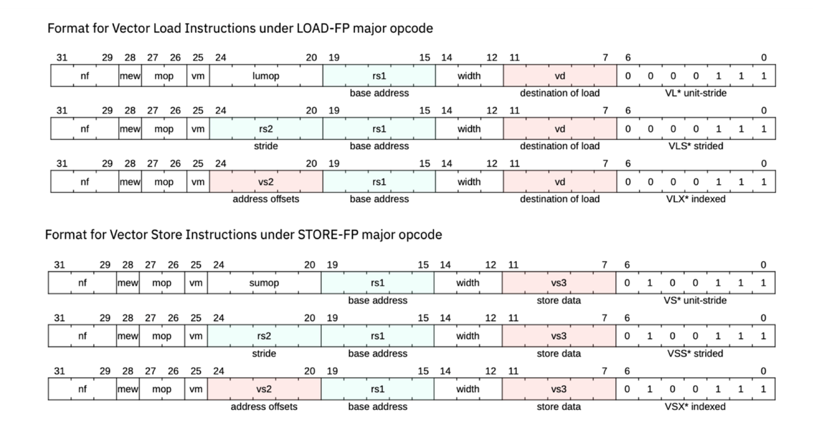

**Fig. 4-1.** Load/store instruction encoding format

Encoding formats for vector memory operations under the LOAD-FP and STORE-FP major opcodes. Unit-stride formats (VL\*/VS\*) access contiguous elements using the lumop/sumop field for special variants. Strided formats (VLS\*/VSS\*) use rs2 to specify the byte offset between elements. Indexed formats (VLX\*/VSX\*) use vs2 as a vector of address offsets for gather/scatter operations. Common fields: nf specifies segment count (1-8 fields), mew enables extended element widths, mop selects addressing mode (00=unit-stride, 10=strided, 01/11=indexed), vm controls masking, rs1 holds the base address, and width encodes element size. Loads use vd as destination; stores use vs3 as source.

*Adapted from "RISC-V Vector Extension Specification, Version 1.0," RISC-V International, licensed under CC-BY 4.0.*

### 4.1.2 Effective LMUL

The vector load/store encoding for element width is independent with the element width defined in the vtype CSR. In many applications, the memory element width is smaller than the vtype element width where the data is extended to larger element width for better accuracy of computing. A critical concept for vector memory operations is effective LMUL. When you configure vtype with a 16-bit element width, LMUL=1, and VLEN=512, you get 32 elements per vector instruction. All subsequent vector instructions operate on 32 elements regardless of the memory element width specified in each instruction.

Consider a load instruction configured for 16-bit elements that loads into register v4. If you then issue a load with 32-bit elements, the hardware must still process 32 elements, now each 32 bits wide. This requires an effective LMUL of 2, so the destination becomes the register group v4–v5. Because effective LMUL=2, the instruction is only legal if the destination register is even-numbered; otherwise, the CPU must raise an illegal-instruction exception. For 8-bit elements, the 32 elements fit in the first half of a single register, so effective LMUL becomes 1/2. For 64-bit elements, the data spans four registers (v4, v5, v6, v7) with effective LMUL of 4—note the effective LMUL is 4, the load instruction must use a vector register number which is divisible by 4.

This mechanism enables mixed-precision workflows. Load 16-bit data into v1, perform a widening add that produces 32-bit results in v4 and v5, then store with 32-bit element width. The implementation calculates the effective LMUL automatically determines how many physical registers participate in each operation.

### 4.1.3 Unit-Stride Operations

Unit-stride operations are the simplest and most efficient memory access pattern. Element 0 comes from address base, element 1 from base+eew, element 2 from base+2×eew, and so forth, where eew is the effective element width in bytes. This contiguous access pattern maximizes memory bandwidth utilization.

**Fault-Only-First Loads.** A specialized variant of unit-stride loads handles cases where the number of valid elements is unknown at load time. The fault-only-first load (`vle*ff`) takes an exception only if the first element faults which means that vl=0 (no valid element) for the vector load operation; faults on subsequent elements silently terminate the load and update vl to reflect how many elements were successfully loaded.

The canonical use case is string processing. To load a null-terminated string of unknown length, set vl to the maximum vector length and issue a fault-only-first load. This is the reverse of strip-mining (chapter 1) where the vector load is part of a loop operation that will stop at a page boundary, the last iteration of the loop is the modified vl by the fault-only-first load.

Note: the exception from the fault-only-first load is most likely from the memory protection error such as page-fault and not a specific element error. Precise load exception can impact the performance tremendously.

**Whole Register Load/Store.** For context switches, the operating system must save and restore the entire vector register file without regard to the current vtype configuration. Whole register loads and stores ignore vtype, vl, and LMUL settings, transferring complete registers at a time. The element width defaults to 8 bits, and the nf field specifies how many consecutive registers to transfer. No masking is permitted; any attempt to use masking with whole register operations raises an illegal instruction exception.

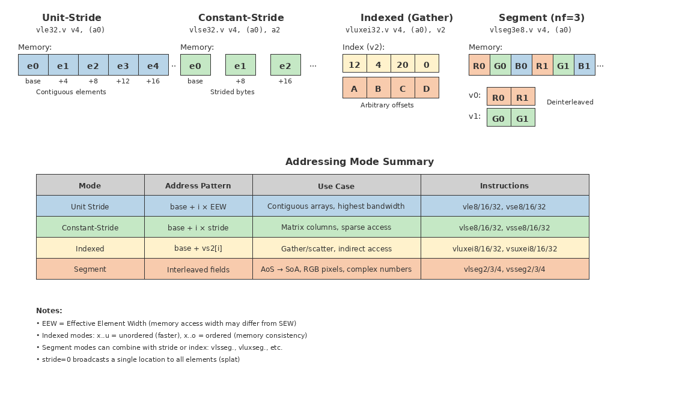

**Fig. 4-2.** Vector Memory Addressing Modes

Four addressing modes for vector memory operations: unit-stride accesses consecutive elements, constant-stride accesses elements at fixed intervals, indexed uses a vector of offsets for gather/scatter patterns, and segment interleaves multiple fields for structure-of-arrays transformations.

### 4.1.4 Constant-Stride Operations

Constant-stride operations access elements separated by a fixed byte offset. With stride=2 and 8-bit elements, element 0 comes from address base, element 1 from base+2, element 2 from base+4—every other byte. With stride=8 and 32-bit elements, successive elements are 8 bytes apart.

A stride of zero has special semantics: it broadcasts a single memory location to all elements of the destination vector. This provides an efficient splat operation for loading scalar values into vector registers without consuming a scalar register.

Note that the stride can be any integer value including 0 and negative. For vector load with stride=0, the same memory element is copied to all register elements where it is necessary to fetch only 1 single memory element. For vector store operation with stride=0, a single store operation can be performed by store the last register element to a memory element. The stride can be any integer number which on worse case can span several physical memory pages. A simpler implementation can restrict the stride vector load/store to a single physical memory page and a reasonable memory range. The compiler can modify the program to performance many load instructions (both scalar and vector) and use permutation instructions to arrange the elements in the vector registers.

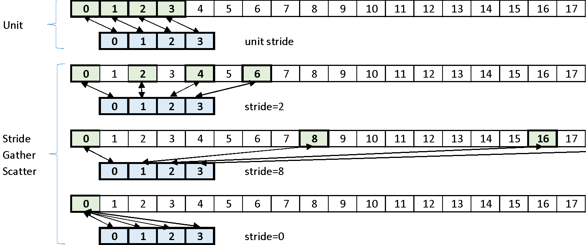

**Fig. 4-3.** Constant-Stride Memory Access

### 4.1.5 Indexed (Gather/Scatter) Operations

Indexed operations use a vector of offsets to access arbitrary memory locations. For gather operations (`vluxei`, `vloxei`), the index vector vs2 contains byte offsets from the base address. If element 0 of vs2 contains 5, element 0 of the destination receives the data at base+5. If element 1 contains 8, element 1 of the destination receives data at base+8. The indices are absolute offsets, not cumulative, and can appear in any order.

Scatter operations (`vsuxei`, `vsoxei`) reverse this process, storing vector elements to indexed memory locations. The same index vector determines where each element lands in memory.

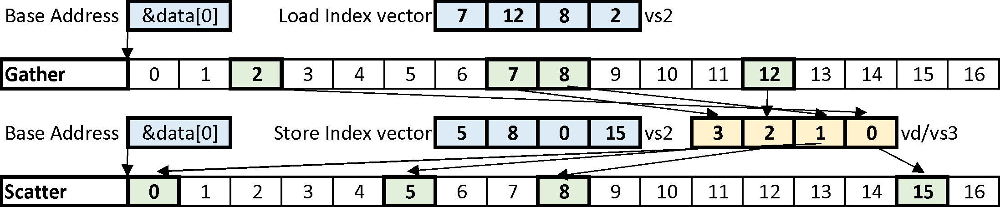

**Fig. 4-4.** Indexed (Gather/Scatter) Memory Operations

The ordered versus unordered distinction matters significantly for indexed operations. Consider a scatter where element 0 targets cache line A, element 1 targets cache line B, element 2 targets cache line A again. An ordered scatter must write to line A, then B, then A again—potentially thrashing the cache. An unordered scatter can reorder these accesses to write elements 0 and 2 to line A together, then element 1 to line B, improving memory efficiency at the cost of strict ordering guarantees.

Note: similar to the stride vector load/store operation, the index can be any integer value where a memory element. A simpler implementation can restrict the index vector load/store to a single physical memory page and a reasonable memory range. With a reasonable memory range, then all index vector load/store can be performed in a single operation where the unordered and ordered vector load/store does not matter. In a way, the index vector load can be done with unit vector loads and permute instruction to re-arrange the register elements. The index vector store is the reversed operation with permutate operation and then unit vector store.

### 4.1.6 Segment Operations

Segment operations load or store multiple interleaved fields into consecutive vector registers. A segment load with nf=4 reads four consecutive memory elements and places them in four different vector registers: element 0 goes to v0, element 1 to v1, element 2 to v2, element 3 to v3, then element 4 goes back to v0 at position 1, and so forth.

This pattern efficiently handles array-of-structures data layouts. Consider an array of RGB pixels where each pixel occupies three consecutive bytes. A segment load with nf=3 separates the interleaved data into three vectors: all red values in v0, all green values in v1, all blue values in v2. Processing can then proceed on each color channel independently.

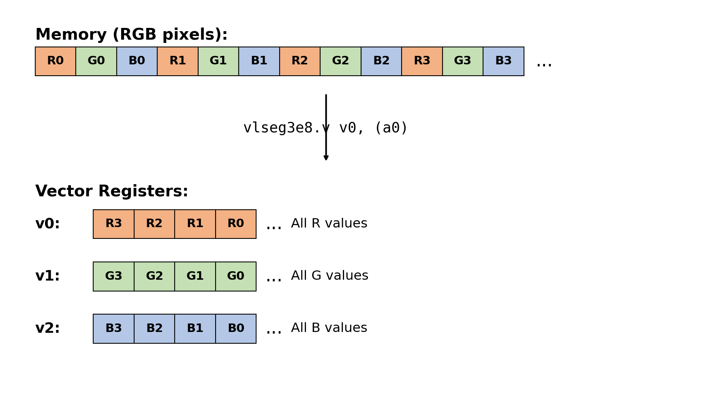

**Fig. 4-5.** Segment Load (nf=3) — Array-of-Structures to Structure-of-Arrays

As shown above, segment load with nf=3 transforms interleaved RGB pixel data in memory into separate vectors for each color channel. The `vlseg3e8.v` instruction reads three consecutive 8-bit fields per element: R, G, and B values are de-interleaved into registers v0, v1, and v2 respectively. This single instruction replaces three separate strided loads and enables efficient SIMD processing of each channel independently.

Segment operations can be achieved with multiple strided loads, but the single-instruction form offers two advantages: reduced instruction count and potential hardware optimization. For a four-field segment load, four stride-4 loads would accomplish the same result, but the segment instruction encodes the entire operation in a single instruction and allows the hardware to optimize memory access patterns.

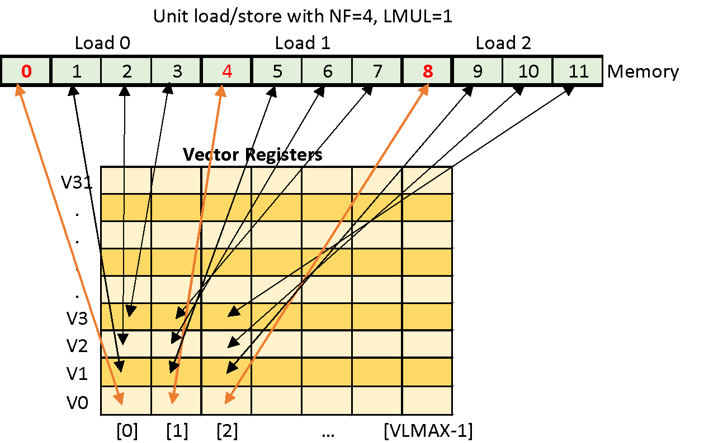

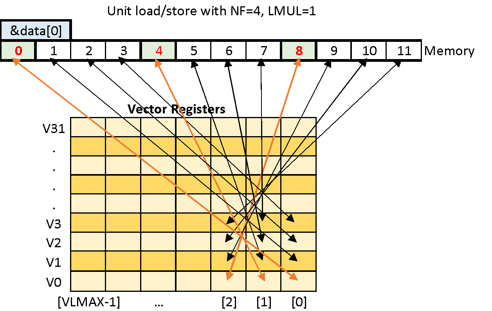

**Fig. 4-6.** Segment Unit-Stride Load/Store with NF=4

The figures above illustrate segment unit-stride load and store operations with NF=4, showing how four interleaved fields are separated into four destination registers during load, and how four source registers are interleaved during store.

Segment operations can also combine with strided and indexed addressing modes.

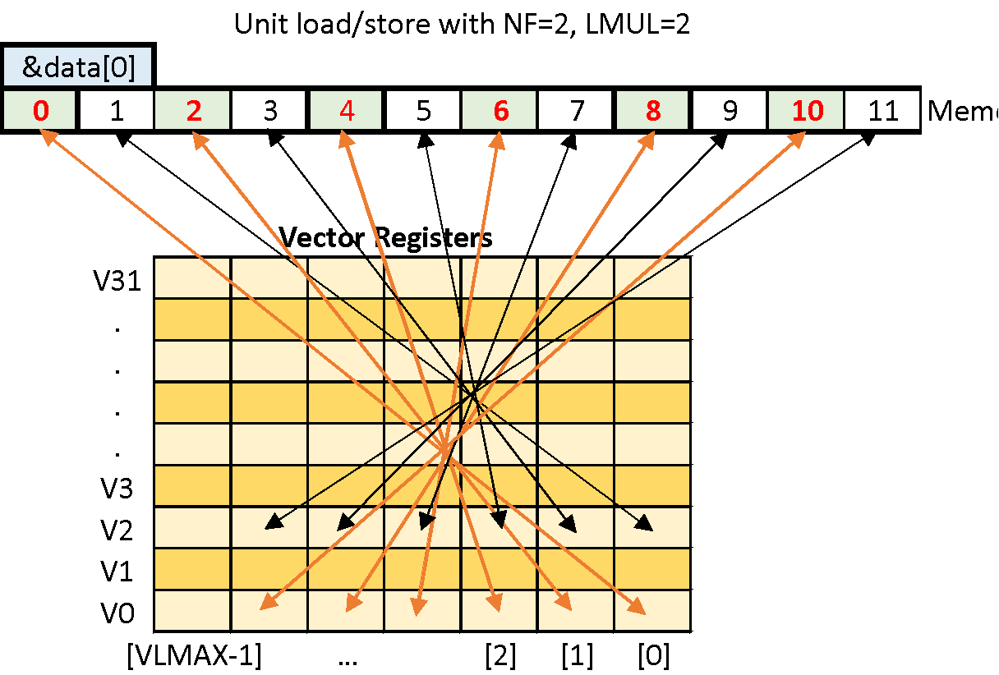

**Fig. 4-7.** Segment Strided Load/Store


**Fig. 4-8.** Segment Indexed Load/Store

When LMUL exceeds 1, segment operations become more complex. With LMUL=2, each segment field occupies two consecutive registers. For nf=4 and LMUL=2, segment 0 spans v0-v1, segment 1 spans v2-v3, segment 2 spans v4-v5, and segment 3 spans v6-v7. Indexed segment operations can produce overlapping data when different indices reference the same or adjacent memory locations—this is architecturally permitted.

In a way, the segment vector load/store is a combination of stride and index vector load/store. The same limitation of physical memory page and memory range should apply to ease implementation.

### 4.1.7 Application: Matrix Multiplication

Segment and indexed loads combine effectively for matrix multiplication. Consider multiplying matrix A by matrix B. Load matrix B using segment loads to place each column into a separate vector register: B[0,*] in v0, B[1,*] in v1, and so forth. For matrix A, use indexed loads with appropriate index vectors to broadcast rows across vector elements. The multiplication then proceeds as element-wise vector operations, with reduction instructions accumulating the dot products.

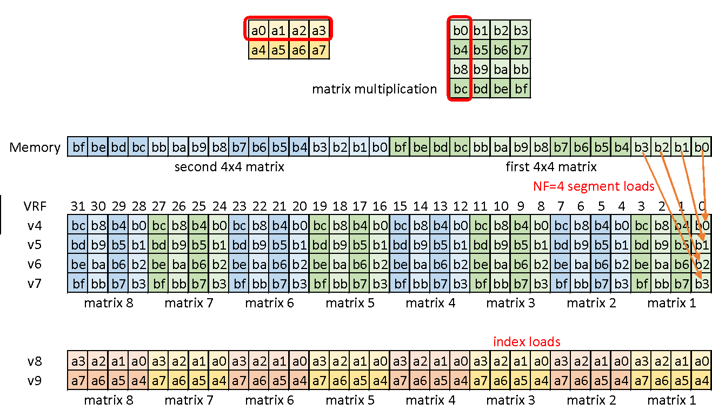

**Fig. 4-9.** Matrix Multiplication Using Vector Operations

---

## 4.2 Compute Operations

Compute instructions perform arithmetic, logical, and comparison operations on vector elements. Integer operations support vector-vector, vector-scalar, and vector-immediate forms. Floating-point operations support vector-vector and vector-scalar forms only, as immediate floating-point values cannot be encoded in the instruction.

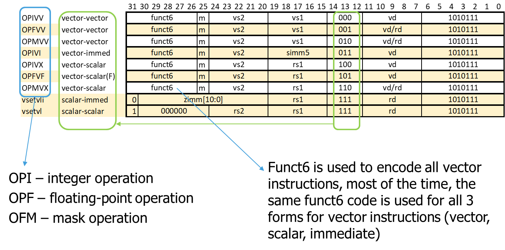

**Fig. 4-10.** Compute Instruction Categories

All compute instructions share the same opcode, with function fields distinguishing among integer operations (OPI), floating-point operations (OPF), and mask operations (OPM). A six-bit function code encodes the specific operation within each category. See Fig. 3-5 for the complete OP-V instruction format encoding.

```
vop.vv vd, vs2, vs1, vm    // vector-vector, vd[i]=vs2[i] op vs1[i]
vop.vx vd, vs2, rs1, vm    // vector-scalar, vd[i]=vs2[i] op x[rs1]
vop.vi vd, vs2, imm, vm    // vector-imm, vd[i]=vs2[i] op imm
vfop.vv vd, vs2, vs1, vm   // vector-vector, vd[i]=vs2[i] fop vs1[i]
vfop.vf vd, vs2, rs1, vm   // vector-scalar, vd[i]=vs2[i] fop f[rs1]
```

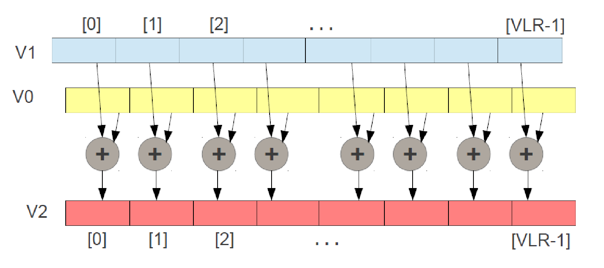

**Fig. 4-11.** Compute Instruction Encoding Format

### 4.2.1 Widening Operations

Widening operations produce results twice as wide as their inputs. The 'w' prefix indicates a widening operation. Two variants exist: single-width sources to double-width result (`vwop.vv`), and mixed-width sources where one operand is already double-width (`vwop.wv`).

```
vwop.v{v,x} vd, vs2, vs1/rs1   // 2*SEW = sign/zero(SEW) op sign/zero(SEW)
vwop.w{v,x} vd, vs2, vs1/rs1   // 2*SEW = 2*SEW op sign/zero(SEW)
vfwop.v{v,f} vd, vs2, vs1/rs1  // 2*SEW = SEW op SEW
vfwop.w{v,f} vd, vs2, vs1/rs1  // 2*SEW = 2*SEW op SEW
```

The implementation differs between integer ALU operations and integer multiply. For integer ALU operations (add, subtract, logical), the hardware sign-extends or zero-extends both source operands to double width, performs the operation at double width, and writes the double-width result.

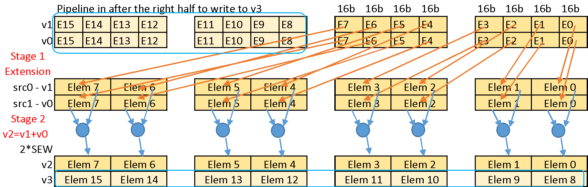

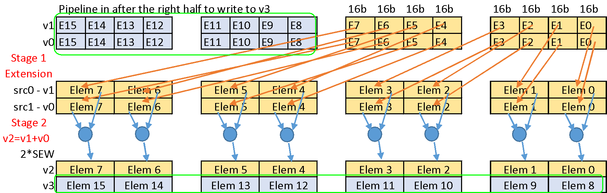

**Fig. 4-12.** Widening Integer Add and Subtract Operations

For integer multiply, the operation is performed at single width, but the result retains all bits of the full product—a 16×16 multiply produces a 32-bit result. Floating-point widening multiply similarly performs the multiply at single precision but retains the extra mantissa bits for the double-width result.

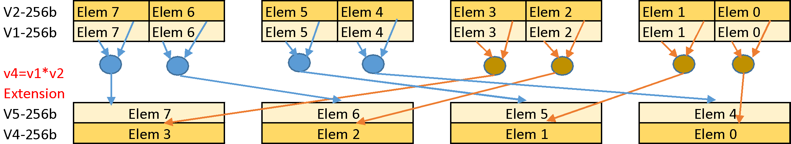

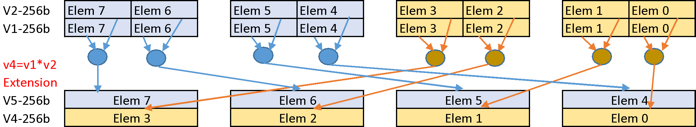

**Fig. 4-13.** Widening Multiply Operations

In hardware implementation, a widening operation with LMUL=1 writes to two consecutive vector registers. The processor decomposes this into two micro-operations: the first processes the right half of the source elements, extends them, computes, and writes to the first destination register; the second processes the left half and writes to the second destination register. These micro-operations can execute in sequence or be pipelined.

**Extension Instructions.** Separate widening extension instructions (`vzext`, `vsext`) convert elements to wider types without computation. These support 2×, 4×, and 8× widening—for example, extending 8-bit elements to 64-bit. The maximum extension factor depends on the configured SEW: with SEW=32, only 2× and 4× extensions are legal, since 8× would require 64-bit elements.

### 4.2.2 Narrowing Operations

Narrowing operations reduce double-width values to single-width results. These apply to shift-right operations (logical and arithmetic) and to the fixed-point clip instructions discussed later. The source operand spans two consecutive registers, while the result fits in a single register.

Consider the pattern: load 16-bit data into v1, load 16-bit data into v2, perform a widening add that produces 32-bit results in v4-v5, then perform a narrowing shift-right to compress the 32-bit results back to 16-bit values in v6. This pattern appears frequently in fixed-point DSP algorithms.

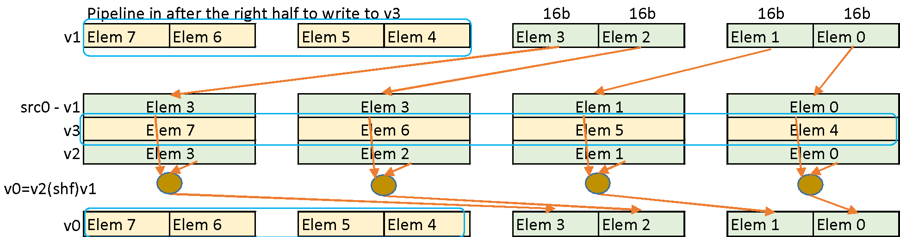

**Fig. 4-14.** Narrowing Shift Operations

Hardware implementation mirrors widening operations in reverse. The first micro-operation reads from the first source register, performs the narrowing operation, and writes to the right half of the destination. The second micro-operation handles the second source register and the left half of the destination.

### 4.2.3 Integer Arithmetic

Standard integer operations include add, subtract, and logical operations (AND, OR, XOR), shift operations (logical left, logical right, arithmetic right), comparison operations (equal, not-equal, less-than, less-equal, greater-than, greater-equal for both signed and unsigned), and min/max. Multiply and divide complete the set. These operations are straightforward extensions of scalar equivalents to vector form.

The complete set of integer arithmetic instructions includes:

- Vector Integer Add, Subtract, Reverse Subtract (including Double Width)
- Vector Integer Extension
- Vector Integer Add-with-Carry / Subtract-with-Borrow
- Vector Bitwise Logical Instructions
- Vector Bit Shift Instructions (including Narrow Width)
- Vector Integer Comparison Instructions, write 1/0 to destination register
- Vector Integer Min/Max Instructions
- Vector Integer Multiply (including Double Width)
- Vector Integer Divide and Remainder
- Vector Integer Multiply-Add/Sub, Multiply-Accumulate (including Double Width)
- Vector Integer Merge and Move Instructions

**Carry and Borrow.** Multi-precision arithmetic requires propagating carries across element boundaries. The RISC-V Vector Extension handles this with paired instructions: one produces the result, another produces the carry-out. This approach maintains a single destination register per instruction—a fundamental RISC-V design principle that simplifies hardware implementation by requiring only one write port per vector instruction.

The carry-out is stored in the mask register v0. For an add-with-carry instruction (`vadc`), vs2 adds to vs1 plus the mask bit, producing the sum. A separate instruction (`vmadc`) computes the carry-out from the same inputs and writes it to the destination mask register. These instructions must execute in sequence: vadc first, then vmadc. Furthermore, the destination of vadc cannot overlap with vs1 or vs2, because modifying a source operand before vmadc executes would corrupt the carry computation. The CPU is responsible to detect the overlapping of source and destination registers to take illegal instruction exception.

### 4.2.4 Multiply-Accumulate

Two multiply-accumulate forms exist. The accumulate form (`vmacc`) computes vd = vd + (vs1 × vs2), adding the product to the existing destination value. The overwriting form (`vmadd`) computes vd = (vd × vs1) + vs2, where the destination is one of the multiplicands. Subtract variants (`vnmsac`, `vnmsub`) negate the product before accumulation. These instructions appear in both integer and floating-point forms.

Note: the VMACC instruction requires 3 source operands for accumulation which is the only vector instruction type with 3 source operands. The first time, the destination register is most likely reset to zero before the accumulation. The accumulated result can be localized to the functional unit thus the VMACC instruction requires only 2 source operands like all other instructions.

### 4.2.5 Merge and Move

The merge instruction (`vmerge`) selects between two sources based on mask bits: where the mask is 0, take from vs2; where the mask is 1, take from vs1. Because the mask serves as the selection control, the vm bit must be 0 (masking enabled)—attempting to execute vmerge with vm=1 produces undefined behavior.

When vm=1 with the merge encoding, the instruction becomes `vmv` (vector move), copying vs1 to vd unconditionally. The specification requires vs2=v0 for this encoding; other vs2 values are reserved for future extensions.

When the source is a scalar register or immediate, and the destination differs from the source, the operation becomes a splat—broadcasting the scalar value to all destination elements.

### 4.2.6 Fixed-Point Arithmetic

Fixed-point operations support DSP applications that require fractional arithmetic without floating-point hardware. Saturating add and subtract (`vsadd`, `vssub`) clamp results to the representable range rather than wrapping. Averaging add and subtract (`vaadd`, `vasub`) compute (a+b)/2 or (a−b)/2 without overflow, useful for filter implementations.

**Fractional Multiply with Rounding.** The `vsmul` instruction performs a signed fractional multiply: multiply two Q-format values, shift right by SEW−1 bits, round according to the vxrm rounding mode, and saturate the result. This implements the common DSP pattern of multiplying two Q15 values to produce a Q15 result. The rounding mode comes from the vxrm CSR (vector fixed-point rounding mode) discussed in Chapter 3.

**Scaling Shift and Clip.** The clip instructions (`vnclip`, `vnclipu`) perform narrowing with saturation. A double-width source is shifted right by a specified amount, rounded according to vxrm, and clipped to the single-width destination range. Signed clip (`vnclip`) saturates to [−2^(SEW−1), 2^(SEW−1)−1]; unsigned clip (`vnclipu`) saturates to [0, 2^SEW−1]. These operations combine the narrowing shift and saturation that would otherwise require multiple instructions.

### 4.2.7 Floating-Point Arithmetic

Floating-point operations parallel the integer set: add, subtract, multiply, divide, square root, min, max, and comparisons. Fused multiply-add operations (`vfmacc`, `vfnmacc`, `vfmsac`, `vfnmsac`, `vfmadd`, `vfnmadd`, `vfmsub`, `vfnmsub`) perform the multiply and add/subtract with a single rounding, improving precision. Conversion instructions translate between floating-point and integer formats, and between different floating-point widths.

The complete set of floating-point instructions includes:

- Vector FP Add, Subtract, Reverse Subtract (including Double Width)
- Vector FP Multiply (including Double Width)
- Vector FP Divide, Reverse Divide
- Vector FP Multiply-Add/Sub, Multiply-Accumulate (including Double Width)
- Vector FP Square-Root, Reciprocal Square-Root Estimate, Reciprocal Estimate
- Vector FP Comparison Instructions
- Vector FP Min/Max Instructions
- Vector FP Merge, Move Instructions
- Vector FP Sign-Injection Instructions
- Vector FP Classify Instructions
- Vector FP/Integer Type-Convert (including Double Width and Narrowing)

### 4.2.8 Reduction Operations

Reduction operations combine all elements of a vector into a single scalar result. Integer reductions include sum (`vredsum`), min/max (`vredmin`, `vredmax`, `vredminu`, `vredmaxu`), and logical reductions (`vredand`, `vredor`, `vredxor`). Floating-point reductions include sum (`vfredusum`, `vfredosum`), min, and max.

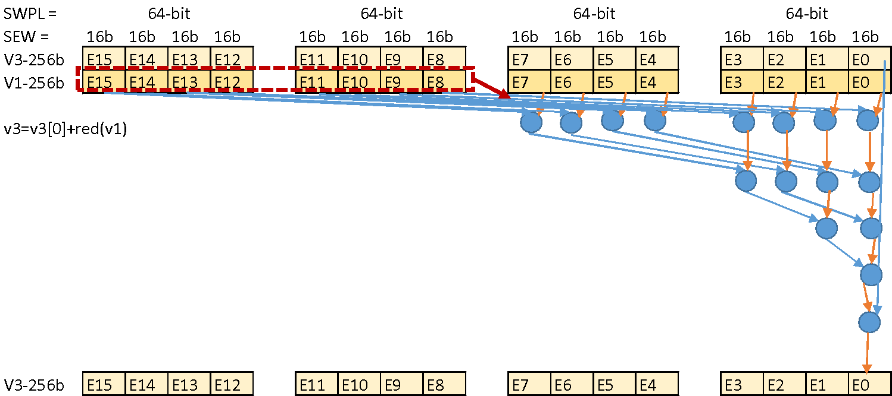

**Fig. 4-15.** Reduction Operation Datapath

The functional units can be reused for Tree-Based Folding Reduction Sum, which is a blocking operation for N cycles where the same functional unit is used in every cycle until the Tree-Based Folding Reduction Sum is produced. Depending on the application, additional functional units can be added for pipelined operation where the throughput is 1 instead of blocking.

An efficient approach to unordered reduction uses a folding algorithm. The tree-structured implementation adds pairs of elements in parallel: the first half of the vector adds to the second half, producing a half-length intermediate; this repeats until one element remains in the destination register. With 16 elements and single-cycle integer addition, the reduction completes in 4 cycles (log₂16). Floating-point addition with 3-cycle latency requires 12 cycles. The ordered reduction cannot parallelize—16 elements with 3-cycle floating-point latency requires 48 cycles where only a single floating-point unit is used.

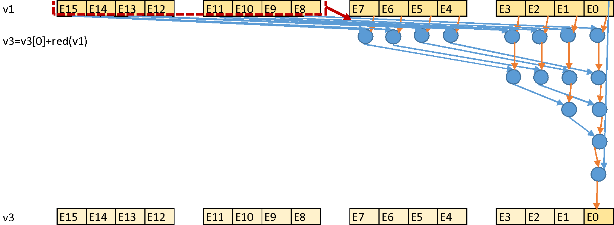

**Fig. 4-16.** Reduction Sum Implementation

Note that the reduction sum instruction is particularly necessary for large matrix multiplication operations where accumulation of all A and B elements is reduced to a single C element.

---

## 4.3 Mask Operations

Mask operations manipulate the single-bit-per-element mask values stored in vector registers. Each element, regardless of SEW, corresponds to one mask bit. Logical operations (`vmand`, `vmnand`, `vmor`, `vmnor`, `vmxor`, `vmxnor`) combine two mask vectors. These instructions ignore LMUL since mask data always fits in a single register.

The complete set of mask operations includes:

- Vector Mask-Register Logical Instructions: AND, NAND, AND-NOT, OR, NOR, OR-NOT, XOR, XNOR
- Vector mask population count (`vcpop`)
- `vfirst` find-first-set mask bit
- `vmsbf.m` set-before-first mask bit
- `vmsif.m` set-including-first mask bit
- `vmsof.m` set-only-first mask bit
- Vector Iota Instruction
- Vector Element Index Instruction

Special encodings of the logical instructions provide common primitives:

```
vmmv.m  = vmand.mm vd, vs, vs   // copy mask register
vmclr.m = vmxor.mm vd, vd, vd   // clear mask register
vmset.m = vmxnor.mm vd, vd, vd  // set mask register
vmnot.m = vmnand.mm vd, vs, vs  // invert mask bits
```

**Mask Queries.** Several instructions extract information from masks. `vcpop` counts the number of set bits (population count). `vfirst` returns the index of the first set bit, or −1 if all bits are clear. `vmsbf` (set-before-first) sets all bits before the first set bit. `vmsif` (set-including-first) sets all bits up to and including the first set bit. `vmsof` (set-only-first) sets only the first set bit. `viota` computes a prefix sum of the mask bits, useful for computing scatter indices for compression operations.

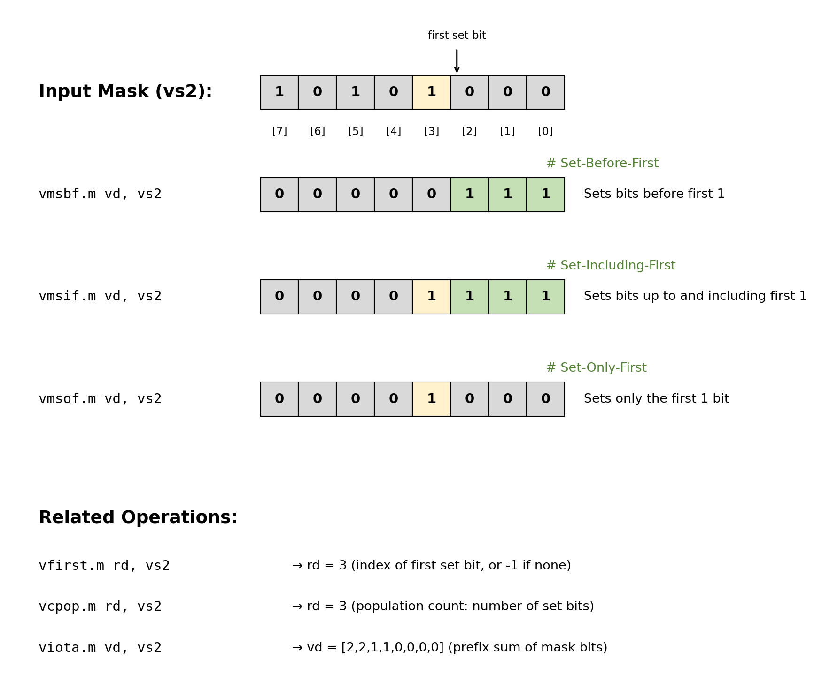

**Fig. 4-17.** Mask Query Operations (vmsbf, vmsif, vmsof, viota)

Given input mask vs2 with the first set bit at index [3]: `vmsbf.m` (set-before-first) sets all bits before the first 1; `vmsif.m` (set-including-first) sets all bits up to and including the first 1; `vmsof.m` (set-only-first) sets only the first 1 bit. These operations enable efficient loop termination detection and prefix computations.

---

## 4.4 Permutation Operations

Permutation operations rearrange elements within or across vector registers. These include scalar element extraction/insertion, sliding, gathering, and compression.

### 4.4.1 Scalar Moves

The `vmv.x.s` and `vmv.s.x` instructions move element 0 between a vector register and an integer scalar register. Similarly, `vfmv.f.s` and `vfmv.s.f` handle floating-point transfers. These provide the interface between vector and scalar execution, extracting reduction results or inserting scalar values for broadcast operations.

### 4.4.2 Slide Operations

Slide operations shift elements up or down within a vector register. `vslideup.vi/vx` moves elements to higher indices: with an offset of 3, element 0 moves to position 3, element 1 to position 4, and so forth. Positions 0, 1, and 2 receive their values based on the tail agnostic (ta) setting—either unchanged or filled with all-ones. `vslidedown.vi/vx` moves elements to lower indices: with an offset of 3, element 3 moves to position 0, element 4 to position 1. Upper positions receive zeros.

```
vslide1up.vx vd, vs2, rs1, vm    // vd[0]=x[rs1], vd[i+1] = vs2[i]
vslideup.vx vd, vs2, rs1, vm     // vd[i+rs1] = vs2[i]
vslideup.vi vd, vs2, uimm, vm    // vd[i+uimm] = vs2[i]
vslide1down.vx vd, vs2, rs1, vm  // vd[i] = vs2[i+1], vd[vl-1]=x[rs1]
vslidedown.vx vd, vs2, rs1, vm   // vd[i] = vs2[i+rs1]
vslidedown.vi vd, vs2, uimm, vm  // vd[i] = vs2[i+uimm]
```

The slide-by-one variants (`vslide1up`, `vslide1down`) incorporate a scalar value. For vslide1up, all elements shift up by one position, and the scalar from rs1 fills element 0. For vslide1down, elements shift down by one, and the scalar fills the highest position. These enable efficient insertion of scalars into vectors for pipelined processing.

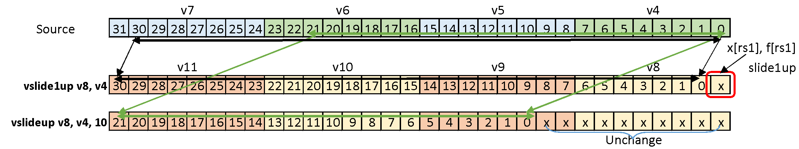

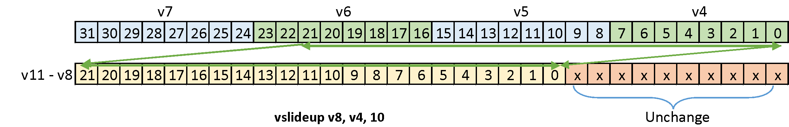

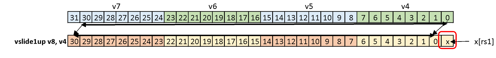

**Fig. 4-18.** Slideup Operations (vslideup, vslide1up)

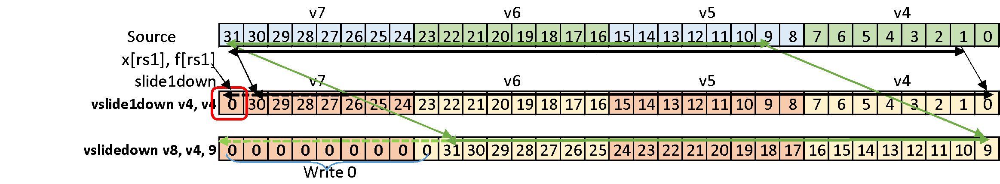

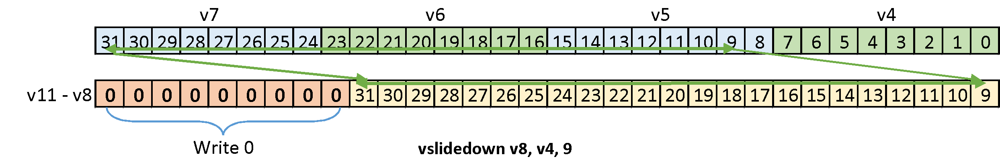

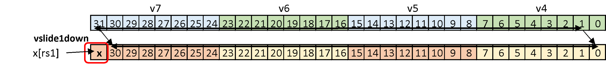

**Fig. 4-19.** Slidedown Operations (vslidedown, vslide1down)

### 4.4.3 Gather Operations

The `vrgather` instruction performs arbitrary element permutation within a vector register. An index vector (vs1) specifies, for each destination position, which source element (from vs2) to copy. If vs1[0]=5, then vs2[5] becomes vd[0]. If vs1[1]=7, then vs2[7] becomes vd[1]. The indices need not be unique or ordered.

```
vrgather.vv vd, vs2, vs1, vm      // vd[i] = vs2[vs1[i]]
vrgatherei16.vv vd, vs2, vs1, vm  // vd[i] = vs2[vs1[i]], vs1 is 16b
vrgather.vx vd, vs2, rs1, vm      // vd[i] = vs2[rs1]
vrgather.vi vd, vs2, uimm, vm     // vd[i] = vs2[uimm]
```

The `vrgather.vx` and `vrgather.vi` instructions copy the same element from vs2 to all elements of destination vector register.

This instruction can replace indexed loads in some algorithms. Load data with a unit-stride operation, then use vrgather to rearrange elements. When the permutation pattern is known at compile time, this approach may outperform indexed memory access, particularly if the data is already cache-resident.

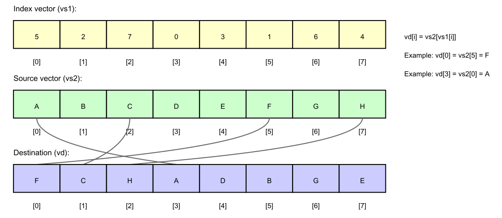

**Fig. 4-20.** Gather Operation (vrgather.vv)

The vrgather instruction performs arbitrary element permutation. The index vector vs1 specifies which element from source vector vs2 to place at each destination position. Here, vs1 = [3, 0, 2, 1, 7, 4, 6, 5] gathers elements from vs2 = [A, B, C, D, E, F, G, H] producing vd = [D, A, C, B, H, E, G, F]. Indices may repeat (duplicating elements) or omit values (discarding elements).

### 4.4.4 Compress

The `vcompress` instruction packs selected elements to the beginning of the destination vector. A mask vector selects which source elements to keep: where the mask bit is 1, copy the source element to the next available destination position; where 0, skip the source element. If the mask is [1,0,0,1,1,0,1,0] and the source contains [A,B,C,D,E,F,G,H], the result is [A,D,E,G,?,?,?,?], with don't-care values in the upper positions.

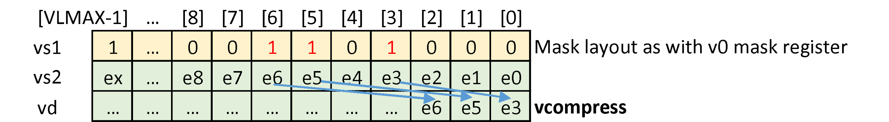

**Fig. 4-21.** Compress Operation (vcompress)

Despite its conceptual simplicity, compress is challenging to implement efficiently. For a 512-element vector (LMUL=8 with 8-bit elements), determining the destination position of each element requires prefix-sum computation across all mask bits, and the data routing network must handle arbitrary compression ratios.

### 4.4.5 Whole Register Move

The `vmv<nr>r` instructions copy one, two, four, or eight consecutive registers from one location to another. Like whole register load/store, these operations ignore vtype and vl settings, transferring complete register contents. The primary use is register allocation flexibility—copying register groups to avoid data hazards or to position operands for subsequent instructions that require specific register alignments.

---

## 4.5 Summary

The RISC-V Vector Extension provides a comprehensive instruction set covering memory access, computation, and data permutation. Memory operations support unit-stride, constant-stride, indexed, and segmented access patterns with flexible element widths. Compute operations span integer, floating-point, and fixed-point domains with widening and narrowing variants. Permutation operations enable the data rearrangement required for complex algorithms.

Several design principles emerge from this instruction set. First, each instruction writes to at most one destination register (or register group), simplifying hardware implementation. Second, the effective LMUL mechanism enables mixed-precision computation without requiring separate instructions for each width combination. Third, ordered and unordered variants of memory and reduction operations let software choose between strict semantics and performance. Fourth, mask operations are first-class citizens with dedicated instructions rather than special cases of other operations.

Chapter 5 examines how these instructions combine in practical algorithms, with complete worked examples demonstrating strip-mining, mixed-precision computation, and efficient memory access patterns.

