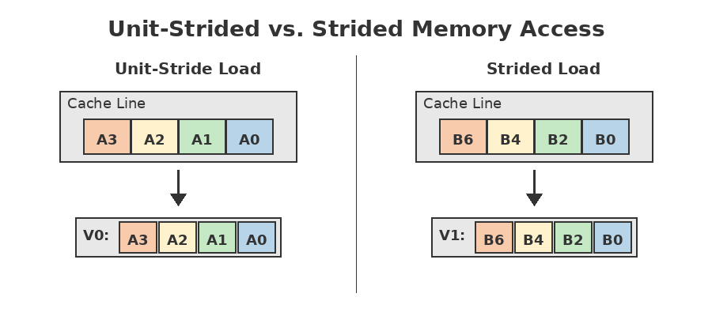
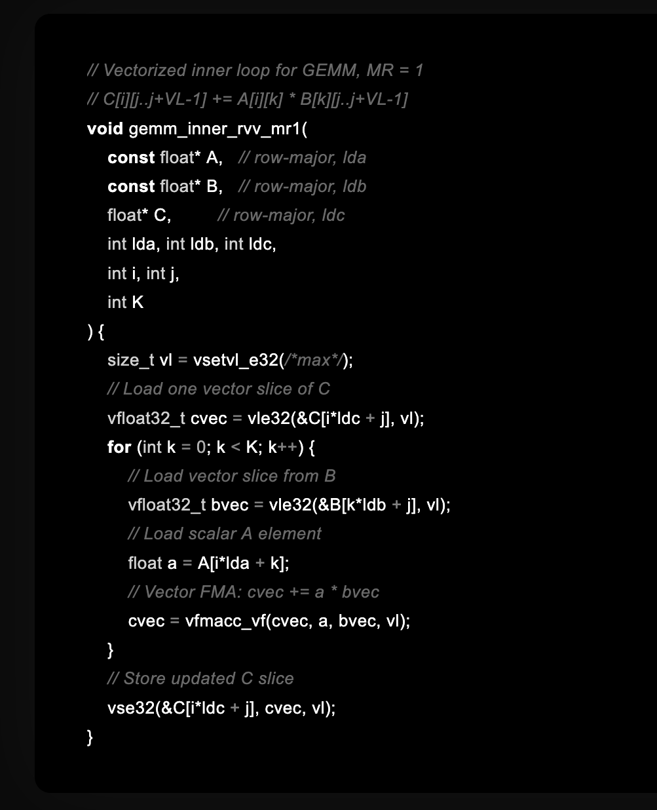
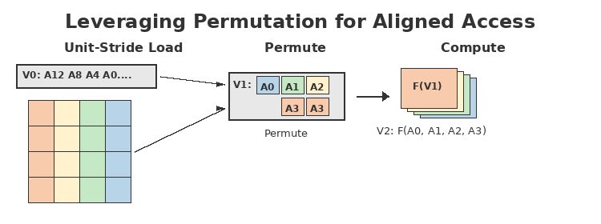
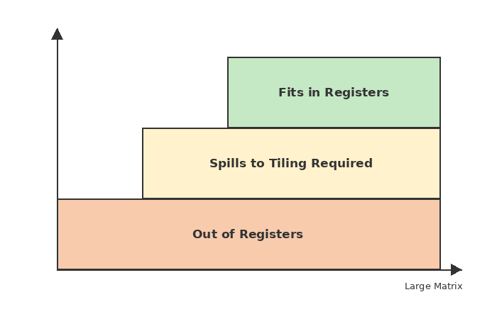
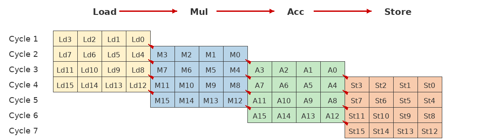
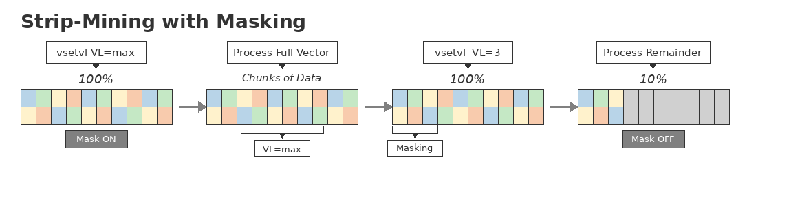

# Chapter 5: Matrix Computation and Performance Analysis with the RISC-V Vector Extension

The preceding chapter established the architectural foundations of the RISC-V Vector Extension, introducing its scalable execution model, register organization, and instruction semantics. Building on that foundation, this chapter moves from architectural principles to concrete execution, demonstrating how vector instructions translate into real performance through representative computational workloads.

---

## 5.1 Introduction

This chapter concludes the technical exploration of the RISC-V Vector Extension by examining representative computation examples and their performance behavior. The goal is to show how scalable vector length, vector register grouping, chaining, gather and permutation operations, and flexible memory access modes combine to deliver high throughput while keeping software portable across implementations.

The discussion centers on two workloads that frequently appear in real systems. The first is single-precision floating-point matrix multiplication, which stresses both arithmetic intensity and memory layout. The second is a low-precision multiply-accumulate loop, a common pattern in signal processing and machine learning inference where load, widening, conversion, and fused arithmetic occur in a tight pipeline.

---

## 5.2 Terminology and Architectural Context

To keep the analysis consistent with the ratified RISC-V Vector Extension, several architectural terms are used throughout. VLEN refers to the vector register length in bits, while SEW is the selected element width. LMUL describes vector register grouping, allowing a logical vector register to span multiple physical registers when wider or longer vectors are needed. Chaining refers to the ability for dependent vector operations to overlap in time, so a consuming instruction can begin once producing lanes become available rather than waiting for full completion.

Memory behavior is described in terms of unit-stride and strided accesses. Unit-stride load and store operations access contiguous elements, which typically makes the best use of caches and memory bandwidth. Strided operations access elements separated by a fixed distance, which can be necessary for certain layouts but often increases cache line traffic. When data arrives in a layout that is not immediately computation-ready, gather, slide, and permutation instructions can rearrange elements into the desired register format.

Strided loads access elements separated by a fixed offset, which can increase cache line traffic and reduce effective bandwidth. Although both modes are supported by the RISC-V Vector Extension, performance is often constrained by memory behavior rather than arithmetic throughput.

**Figure 5-1.** Unit-stride versus strided vector memory access.

---

## 5.3 Example: Single-Precision Matrix Multiplication

To make these ideas concrete, the following example walks through the inner kernel of a single-precision matrix multiplication written directly using the RISC-V Vector Extension. Rather than presenting a full blocked GEMM implementation, the focus is deliberately narrowed to the vectorized inner loop that performs the core multiply-accumulate operation. For a fixed output row *i* and a vector-width range of columns *j...j+VL−1*, the inner loop computes:

This example computes a vector slice of one output row at a time. Vectorization is applied across the column dimension, while accumulation over the shared inner dimension is expressed explicitly in a loop. The code illustrates how matrix multiplication is naturally mapped onto vector load, fused multiply-accumulate, and store operations, and how scalar values are broadcast into vector arithmetic when appropriate.

This formulation expresses matrix multiplication entirely using vector operations along one dimension, but reuse across the second dimension must still be orchestrated explicitly in software, highlighting the structural gap between vector execution and matrix-dominated workloads.

By examining this kernel in isolation, it becomes easier to contrast scalar and vector execution models and to see how RVV expresses data parallelism without hard-coding a fixed vector width.

### 5.3.1 Problem Definition

The first example evaluates floating-point matrix multiplication using 32-bit elements. The workload assumes multiple independent matrix multiplications, which allows the implementation to exploit data-level parallelism by operating on several matrices at once. When the combined register demand of the matrices and intermediate results fits within the available vector register file, multiple instances can be processed concurrently, reducing loop overhead and improving throughput.

The second example, presented later in this chapter under "Example: Vector Multiply-Accumulate Pipeline," examines a low-precision multiply-accumulate kernel representative of signal processing and machine learning inference workloads. Input data is stored in compact integer formats and widened or converted prior to accumulation, emphasizing sustained throughput and pipeline utilization rather than arithmetic density.

### 5.3.2 Strided Load Implementation

In the strided-load approach, corresponding elements from successive matrices are separated in memory by a constant offset. To load these elements efficiently, the code uses strided vector loads to bring matching positions from many matrices into vector registers. Once loaded, the multiply-accumulate sequence computes partial products and accumulates them into result registers using fused multiply-add operations.

This method can deliver strong performance because it keeps the arithmetic units busy while amortizing loop control across multiple matrices. However, strided loads often require more cache line activity than unit-stride access, and the memory subsystem can become the limiting factor if the stride pattern prevents efficient line reuse.

### 5.3.3 Unit-Stride Load with Permutation

A second implementation replaces strided loads with unit-stride loads, followed by vector permutation operations that reorganize elements into a computation-friendly layout. The key idea is to load data contiguously, minimizing cache line fetches and improving bandwidth efficiency, and then use gather and slide operations to assemble the registers needed for the multiply-accumulate schedule.

This technique can reduce memory traffic significantly, at the cost of additional shuffle instructions. In many systems the tradeoff is favorable, because fewer non-contiguous memory operations often outweigh the overhead of rearrangement, particularly when memory bandwidth or cache behavior constrains performance.

Rather than using strided memory accesses, data can be loaded contiguously using unit-stride loads and then rearranged in registers using gather, slide, or permutation operations. This approach reduces memory traffic while preserving the data layout required for efficient vectorized computation.

**Figure 5-2.** Unit-stride load followed by vector permutation to form computation-ready registers.

### 5.3.4 Performance Implications

For small matrices that fit within the vector register file, both approaches can achieve comparable cycles per matrix when carefully scheduled. The unit-stride method typically reduces cache line accesses and can improve overall efficiency, while the strided method can be simpler when the data layout naturally matches the strided access pattern. Across both cases, the dominant lesson is that memory access patterns frequently determine the ceiling on performance, and vector software benefits when it can favor contiguous transfers and minimize scattered access.

### 5.3.5 Scaling Behavior for Larger Matrices

As matrix dimensions grow, the register footprint of inputs, temporaries, and outputs can exceed the available vector registers. When that happens, the computation must be decomposed into blocks, such as processing a subset of rows or columns at a time, accumulating partial results across multiple iterations. This introduces additional loads, stores, and loop structure, which increases the cycle count per matrix multiplication even though the arithmetic units remain efficient.

Both strided and unit-stride strategies remain applicable, but efficiency now depends heavily on tiling choices and how well the tile dimensions align with VLEN and LMUL. When the tile shape maps cleanly to vector lanes, utilization remains high; when it does not, some lanes carry no useful work and throughput falls. This sensitivity is not unique to RISC-V Vector but is a general property of vector architectures, reinforcing the importance of tiling and layout-aware kernels.

**Figure 5-3.** Relationship between matrix size and vector register capacity.

When matrices and intermediate results fit entirely within the vector register file, multiple instances can be processed concurrently with high efficiency. As matrix dimensions grow beyond available register capacity, tiling and partial accumulation become necessary, increasing memory traffic and reducing utilization.

Beyond raw throughput, predictability has emerged as a critical requirement for modern AI and data-parallel workloads. The author has previously explored these ideas in a series of essays on deterministic execution and AI-oriented processor design. In "Beyond Von Neumann: Toward a Unified Deterministic Architecture" (VentureBeat), the author argues that as machine learning inference, real-time analytics, and safety-critical systems become more prevalent, worst-case execution behavior matters as much as peak performance. Systems that exhibit wide performance variance due to speculation, cache effects, or control hazards complicate scheduling, capacity planning, and power management.

Vector execution mitigates many of these concerns by emphasizing regular computation, explicit data movement, and deterministic scheduling. When combined with scalable vector length and well-chosen tiling strategies, vectorized kernels can deliver both high throughput and predictable performance envelopes. This predictability reinforces the value of vector architectures not only as performance engines but as reliable computational substrates for AI workloads that must meet latency and consistency constraints.

---

## 5.4 Example: Vector Multiply-Accumulate Pipeline

### 5.4.1 Workload Description

This workload loads low-precision integer data, widens or converts it, and then performs repeated multiply-accumulate operations. Such patterns appear frequently in signal processing and machine learning inference, where input data is compact but computation is performed at higher precision. The loop structure emphasizes sustained throughput, with the objective of approaching one effective vector operation per cycle through careful overlap of load, conversion, and arithmetic.

### 5.4.2 Chaining and Pipeline Utilization

A key performance feature in this workload is chaining, which allows the pipeline stages of load, integer operations, conversion, and fused multiply-add to overlap. When the fused multiply-add units are fully pipelined, they can sustain a steady issue rate, and the loop can achieve a high fraction of peak arithmetic throughput. As vector length scales upward, the number of elements processed per instruction increases, allowing the same control structure to deliver proportionally higher throughput.

Vector instruction chaining allows dependent operations such as loads, conversions, and fused multiply-accumulate instructions to overlap in time. Partial results flow directly between pipeline stages, enabling sustained throughput without speculative execution.

**Figure 5-4.** Vector pipeline execution with instruction chaining.

Vector chaining concept is derived from the "load/store multiple" instruction. Instead of loading/storing a single register, the load/store multiple instruction moves a block of memory data into multiple registers. The "multiple" concept is extended to the arithmetic instructions where arithmetic operations are performed on multiple registers. The multiple operations (LMUL > 1), allow the vector processor to chain the operations in consecutive cycle. The chaining concept works better with vector rather than scalar codes where the vector code is expected to operate on large number of elements.

### 5.4.3 Effect of ISA Evolution

Earlier draft versions of the vector specification included combined operations that loaded and extended elements in a single instruction. Later revisions separated these into distinct load and extension instructions. The separation increases instruction count modestly and can introduce a small performance penalty, but it also clarifies the RISC concept of the ISA and improves extensibility. Software can accommodate the change with minor kernel adjustments while retaining most of the benefits of vector execution. The advantage of RISC-V is the custom extension where the vector load with extended elements can be defined as custom instruction to boost the performance. In similar token, as mentioned earlier, the index vector load/store could be broken into 2 instructions: unit vector load and vector vrgather.

---

## 5.5 Design and Implementation Considerations

Vector processor implementations typically balance configurability, simplicity, and performance. Configurability can include vector length options, memory bus width, and cache sizing, allowing systems to target different power and area envelopes. Simplicity can be a first-order requirement because it reduces verification complexity and can shorten development cycles. Performance comes from parallel, pipelined functional units, efficient memory access, and a tight coupling between register operations and data movement.

Many implementations also provide mechanisms for streaming data between the vector unit and memory regions that behave like local vector memory. Such streaming paths can reduce overhead for pre-processing and post-processing and can complement cache-based access when data is large or when software wants predictable transfer behavior.

---

## 5.6 Comparison with Fixed-Width SIMD Approaches

Compared with fixed-width SIMD architectures, the RISC-V Vector Extension emphasizes scalability and portability. Vector-length agnostic programming allows the same binary to adapt to different hardware widths, while LMUL provides flexibility in how data is packed and operated upon. Chaining further increases the potential for sustained throughput by enabling deeper overlap among dependent vector operations. Taken together, these characteristics allow performance to scale with implementation width without requiring software to be rewritten for each target.

---

## 5.7 Tooling and Performance Analysis

High-performance vector software benefits from tooling that makes execution behavior visible. Cycle-accurate simulation, instruction-level profiling, and pipeline visualization help developers identify stalls, bubbles, and memory bottlenecks. With that feedback, kernels can be tuned by adjusting data layout, reducing scattered accesses, rebalancing unrolling, and improving overlap between memory operations and arithmetic.

---

## 5.8 Summary

This chapter used concrete computation kernels to show how the RISC-V Vector Extension enables high throughput through scalable vector length, flexible register grouping, efficient memory access modes, and chaining. Across both matrix multiplication and multiply-accumulate loops, performance is shaped as much by data layout and memory behavior as by peak arithmetic capability. When kernels are structured to favor contiguous access, align tiles to vector lanes, and exploit overlap among pipeline stages, vector execution can deliver dramatic speedups while preserving portability across implementations.

To place these examples in proper historical context, it is useful to understand how vector processing evolved from earlier fixed-width SIMD architectures. Early SIMD designs such as SSE and AVX tied software directly to a fixed hardware width, requiring recompilation or rewriting to take advantage of wider datapaths. The RISC-V Vector Extension departs from this model by defining vector semantics independently of physical register width. Software specifies the active vector length dynamically at runtime, allowing the same binary to scale transparently across implementations with different vector widths. This architectural choice underpins the portability and longevity of vectorized code demonstrated throughout this chapter.

At the microarchitectural level, vector performance derives not only from parallel datapaths but from deep pipelining and instruction chaining. Vector pipelines are designed so that different stages of successive vector instructions overlap in time, allowing dependent operations such as loads, conversions, and arithmetic to execute concurrently without full serialization. Chaining enables partial results to flow directly from one functional unit to the next, which explains the high sustained throughput observed in multiply-accumulate workloads. Rather than relying on speculative execution, vector processors achieve performance through deterministic overlap of long-running operations.

This deterministic overlap stands in contrast to the speculative execution techniques that have dominated general-purpose CPU design for decades. As discussed by the author in "Moving Past Speculation: How Deterministic CPUs Deliver Predictable AI Performance" (VentureBeat), speculative architectures attempt to maximize average performance by predicting future control flow or data dependencies, executing work that may later be discarded. While effective for irregular scalar workloads, speculation introduces variable latency, wasted energy from mispredictions, and increasing architectural complexity.

Deterministic execution models take a different approach. Instructions are scheduled based on known dependencies and resource availability rather than prediction, allowing pipelines to remain busy without guesswork. For data-parallel workloads, especially those dominated by regular loops and predictable memory access, deterministic execution can achieve high utilization with bounded latency. Vector architectures naturally align with this model because long-running vector instructions expose ample instruction-level parallelism without relying on speculative control flow. In this sense, instruction chaining and pipeline overlap in vector execution represent a form of structured, deterministic concurrency rather than speculative acceleration.

Large data sets are processed in chunks whose size is determined at runtime using vector-length configuration instructions. Masking ensures correctness for the final partial iteration. This technique allows vectorized code to scale naturally to problem sizes larger than the maximum supported vector length.

**Figure 5-5.** Strip-mining using dynamic vector length and masking.

When data sets exceed the maximum vector length supported by a given implementation, vectorized code relies on a technique known as strip-mining. In this approach, loops iterate over the input data in chunks whose size is determined dynamically using vector-length configuration instructions. Masking ensures correctness for the final partial iteration. Strip-mining allows algorithms such as matrix multiplication to scale naturally to arbitrarily large problem sizes while preserving the same vectorized structure used for smaller workloads.

From a hardware perspective, implementing a scalable vector architecture introduces nontrivial trade-offs. Wider vector registers increase register file bandwidth requirements and complicate precise exception handling, while aggressive memory access patterns place additional demands on cache and load-store units. The examples in this chapter illustrate how careful use of unit-stride accesses, register grouping, and permutation operations can mitigate these challenges and deliver high performance without excessive hardware complexity.

Although the case studies in this chapter focus on matrix multiplication and accumulation loops, the same architectural mechanisms apply across a wide range of workloads. Scientific computing, signal processing, multimedia, data compression, cryptography, and machine learning all benefit from vector execution models that emphasize regular data parallelism and predictable memory access. The RISC-V Vector Extension provides a general-purpose foundation for these domains, enabling high performance while maintaining architectural simplicity and software portability.

Throughout this chapter, several architectural behaviors are best understood visually. Key diagrams include the vector register file organization defined in the RISC-V Vector specification, illustrations of unit-stride versus strided memory access patterns, examples of LMUL-based register grouping, and pipeline timelines demonstrating instruction chaining across vector functional units. These figures align directly with the official RISC-V Vector specification and are referenced conceptually here to maintain architectural accuracy without binding the discussion to a specific implementation.

Terminology in this chapter is used consistently with earlier chapters. Vector length refers to the architectural VLEN parameter, register grouping corresponds to LMUL, and chaining denotes temporal overlap of dependent vector instructions within the execution pipeline. These terms are applied uniformly to ensure conceptual continuity across the book.

A broader architectural implication, highlighted by the author in "Beyond Von Neumann," is the movement toward unifying scalar, vector, and matrix computation under a single deterministic execution framework. Rather than treating vector or matrix engines as peripheral accelerators with separate programming models and memory spaces, unified designs schedule all forms of computation along a shared timeline. In such systems, vector pipelines are first-class execution resources, enabling data-parallel and control-oriented code to coexist without excessive synchronization or data transfer overhead.

From a broader perspective, the examples in this chapter highlight why vector architectures are again central to modern computing. As workloads shift toward data-parallel and AI-dominated execution, architectures that prioritize scalable throughput, deterministic performance, and software longevity become increasingly valuable. The RISC-V Vector Extension demonstrates that high performance need not come at the expense of architectural simplicity, positioning vector processing as a foundational capability for the next generation of computing systems.

---

## References

Tran, Thang. "Moving Past Speculation: How Deterministic CPUs Deliver Predictable AI Performance." VentureBeat, 2024.
https://venturebeat.com/ai/moving-past-speculation-how-deterministic-cpus-deliver-predictable-ai

Tran, Thang. "Beyond Von Neumann: Toward a Unified Deterministic Architecture." VentureBeat, 2024.
https://venturebeat.com/ai/beyond-von-neumann-toward-a-unified-deterministic-architecture
