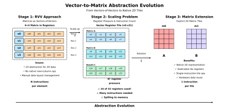
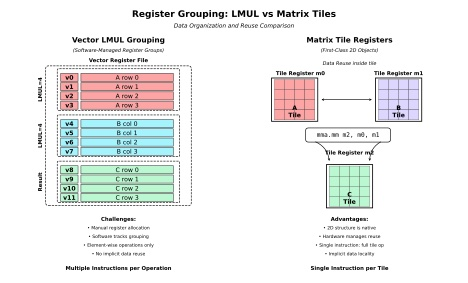
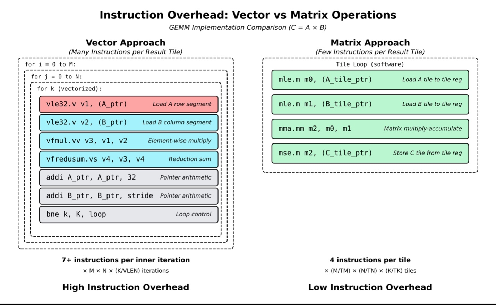
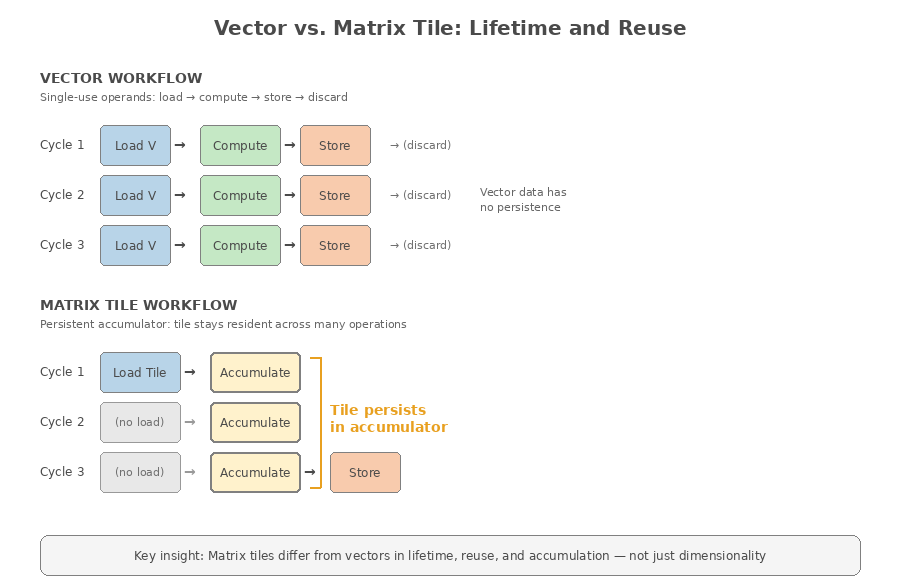

# Chapter 6: From Vectors to Matrices: The Architectural Path to the RISC-V Matrix Extension

---

## 1. RVV Solved the Portability Problem

The RISC-V Vector Extension (RVV) was designed to address a long-standing challenge in parallel computing: how to express data-parallel programs in a way that remains portable across implementations with vastly different hardware capabilities. By decoupling software from fixed vector widths, RVV allows the same binary to execute correctly on processors with different vector lengths, register file sizes, and microarchitectural organizations.

Key architectural features—such as explicit vector length (VL), element width (SEW), and register grouping (LMUL)—enable software to scale across generations without recompilation. This approach preserves software investment while allowing hardware designers to innovate freely. As a result, RVV succeeds where earlier fixed-width SIMD and vector ISAs struggled: it provides a stable, forward-looking programming model for general data-parallel computation.

Importantly, RVV does not target a single application domain. It supports irregular control flow, mixed data types, and boundary-heavy loops just as naturally as dense numeric kernels. In doing so, RVV establishes itself as a general-purpose vector architecture rather than a narrow accelerator interface.

Dense linear algebra kernels, such as matrix multiply-accumulate, can be implemented correctly and portably using vector loads, vector arithmetic, reductions, and strip-mining techniques. As these correctly expressed matrix kernels grow in size and intensity, the structural cost of mapping two-dimensional computation onto a one-dimensional vector abstraction begins to surface.

**Figure 6-1.** Evolution from vector-packed matrices to native tile registers.

RVV forces 2D matrices into 1D vectors, creating layout overhead and heavy register pressure, while matrix-extension tiles provide true 2D storage and single-instruction tile operations that eliminate per-element work.

The figure shows the software burden created when 2D matrices are forced into 1D vector registers. Stage 1 illustrates the RVV method: a 4×4 matrix is split across four vector registers (v0–v3), requiring manual layout handling and offering no native row×column operations. Stage 2 highlights the scaling issue: storing matrices A, B, and C for larger problems consumes 24 of 32 registers, causing heavy register pressure, spilling, and high instruction overhead. Stage 3 shows the matrix-extension solution, where tile registers (m0, m1) provide true 2D representation, enabling single-instruction tile operations and hardware-managed data reuse—cutting work from per-element instruction sequences to one instruction per tile.

---

## 2. Matrix Workloads Exposed a Structural Mismatch, Not a Failure

As RVV has been applied to modern workloads—particularly in artificial intelligence and machine learning—it has proven fully capable of expressing matrix-dominated computation. Mapping inherently two-dimensional matrix structure onto a one-dimensional vector abstraction introduces costs that grow rapidly as problem sizes scale.

**Figure 6-2.** Register Grouping: LMUL vs Matrix Tiles.

The figure shows the comparison of software-managed vector grouping versus hardware-managed matrix tiles. LMUL-based vector groups require manual allocation and element-wise operations, while matrix tile registers provide native 2D structure, implicit data reuse, and full-tile compute in a single instruction.

This software-managed grouping is the root of a second structural cost: every slice of a logical matrix tile must be loaded, multiplied, reduced, and advanced through explicit vector instructions. Because RVV exposes only one-dimensional structure, the compiler and programmer must reconstruct two-dimensional behavior through repeated vector-width operations. As problem sizes grow, this reconstruction manifests as rising instruction overhead, which the next figure illustrates.

**Figure 6-3.** Instruction Overhead: Vector vs Matrix Operations

The figure box on the left shows how vector implementation incurs high instruction overhead. Each inner-loop pass requires 7+ instructions (load A, load B, multiply, reduce, two pointer updates, and a branch), repeated M × N × (K/VLEN) times. For a 256×256 GEMM with VLEN=32, this produces on the order of several million instructions. The dense row of gray boxes illustrates this large instruction stream that must be fetched, decoded, and executed. Right: The Matrix approach replaces this with just four tile-level instructions per output tile, shown as widely spaced green boxes, highlighting the dramatic reduction in instruction count.

This instruction expansion is not an artifact of any particular implementation, but a direct consequence of expressing two-dimensional computation through repeated one-dimensional vector slices. As workloads grow, the underlying structure of matrix kernels amplifies these effects, revealing deeper pressures in the vectorized formulation.

The box on the right shows how the Matrix approach achieves extremely low instruction overhead. Each output tile requires only four instructions—load A tile, load B tile, perform a fused matrix multiply-accumulate, and store the result. The total work scales with the number of tiles, (M/TM) × (N/TN) × (K/TK), rather than with every vector-width slice. In a 256×256 GEMM with 16×16 tiles, this yields just 4,096 tiles and 16,384 total instructions—over 200× fewer than the vector implementation. The widely spaced green boxes visually emphasize how each instruction performs an entire tile's worth of computation, in contrast to the dense instruction stream required by the vector approach. At some point, the physical implementation of the matrix approach would be too large for implementation.

However, these workloads also reveal structural pressures that are not unique to RISC-V. Matrix kernels are characterized by extremely high arithmetic intensity, deep reuse of operands, and long inner loops with regular access patterns. When expressed purely as vector code, these properties can lead to increased instruction overhead, significant register pressure, and repeated movement of data that is conceptually part of a single logical tile.

### 2.1 Matrix Execution Reflects a Physical Two-Dimensional Compute Structure

Although the Matrix Extension presents tiles as architectural registers, these tiles correspond directly to a physical two-dimensional compute structure in hardware. Matrix execution is implemented by an array of multiply-accumulate processing elements (PEs) arranged in a fixed geometry. Each PE performs a simple operation—multiplying one element from matrix A with one element from matrix B and accumulating the result—while the array as a whole computes a full tile product through coordinated data movement and local accumulation.

This execution model differs fundamentally from vector execution. In a vector unit, elements stream through lanes and are typically consumed once per instruction. In a matrix array, operands remain resident and are reused across many cycles as they propagate across the two-dimensional array, while partial sums remain local to the PEs until the tile computation completes. This spatial reuse is the defining efficiency advantage of matrix execution.

When a tile is loaded, its contents remain resident across many internal multiply-accumulate operations, allowing memory access and instruction overhead to be amortized over a large amount of computation. As a result, matrix tile registers have a fundamentally different lifetime and reuse model than vector registers. A vector register typically participates in a small number of operations before being overwritten or advanced, whereas a matrix tile may participate in dozens or hundreds of internal MAC operations before being written back to memory. This distinction allows matrix instructions to collapse deeply nested inner loops into a single architectural operation.

**Figure 6-4.** Vector vs. matrix tile lifetime and reuse.

Vector operands follow a single-use pattern—load, compute, store, discard—with no persistence across iterations. As shown in the figure, matrix tiles remain resident in the accumulator across many operations, amortizing load overhead.

A matrix multiply kernel naturally decomposes into a tiled loop nest. Each iteration operates on a block of matrix A spanning the M and K dimensions, a block of matrix B spanning the K and N dimensions, and a block of matrix C that accumulates results across the M and N dimensions. For clarity, the extents of these blocks may be described as TM, TK, and TN, respectively. A matrix instruction operates on exactly one such tile at a time.

Consequently, tile geometry directly determines the blocking strategy used by software and compilers, the amount of data reuse achievable per load, the ratio of computation to memory traffic, and the number of instructions required per output element. Tiles that are too small increase instruction and load/store overhead, while tiles that are too large increase hardware complexity, area, and timing pressure. Effective matrix architectures therefore select tile sizes that balance compute density with practical implementation constraints.

Tile size also sets the fundamental performance ceiling of a matrix implementation. Larger tiles increase the ratio of computation to memory traffic and allow more reuse per load, but they require more PEs, more local storage, and longer interconnect paths. Smaller tiles reduce hardware cost and improve timing closure but increase instruction count and memory pressure. Each implementation therefore selects a tile geometry that maximizes sustained throughput within practical design limits, making tile size a first-order architectural parameter rather than a microarchitectural detail.

Because matrix tiles are held locally during execution, the capacity of the tile register file determines how long operands and partial results can remain resident. Retaining accumulation tiles across the full K dimension avoids repeated loads and stores of partial sums, while retaining tiles of A or B across multiple operations enables operand-stationary or output-stationary execution styles. These behaviors are not software conventions layered on top of the architecture; they are direct consequences of the storage and reuse properties exposed by the hardware.

Matrix arrays support different data-movement strategies depending on which operands remain resident. In an operand-stationary style, either A or B stays fixed in the array while the other operand streams through, maximizing reuse of one matrix. In an output-stationary style, the accumulation tile C remains resident, and partial sums are updated locally until the full tile is complete. These strategies are not software conventions but direct consequences of how data flows through the PE array, and they allow matrix instructions to amortize memory traffic across large amounts of computation.

This tile-based execution model explains why matrix extensions coexist naturally with vector architectures. RVV remains responsible for control flow, data marshaling, layout transformation, and irregular computation, while matrix execution accelerates dense inner loops where computation is regular and reuse is high. By fixing tile geometry in hardware while leaving vector length scalable, the architecture preserves RVV's portability while enabling efficient execution of matrix-dominant workloads. As with vector length in RVV, the number and dimensions of matrix tiles are implementation-defined, allowing hardware designers to balance area, power, and performance while preserving a consistent programming model.

This hardware organization is precisely what the Matrix Extension exposes architecturally: a tile-level abstraction that mirrors the underlying compute fabric while remaining compatible with RVV's scalable vector model.

### 2.2 Software Responsibilities in a Tile-Accelerated Architecture

While the Matrix Extension introduces a native abstraction for two-dimensional computation, software remains responsible for orchestrating the broader structure of matrix kernels. Tile-level execution does not eliminate the need for vector operations; instead, it shifts the division of labor between software and hardware. RVV continues to manage the outer structure of computation—loop control, pointer arithmetic, data marshaling, and layout transformation—while matrix instructions accelerate the dense inner loops where reuse is highest.

Software determines how matrices are partitioned into tiles, how those tiles are scheduled, and how data is staged into and out of the tile register file. These responsibilities include selecting blocking factors that match the implementation's tile geometry, arranging memory layouts to maximize locality, and sequencing tile loads and stores to maintain a steady flow of operands to the compute array. Compilers and libraries must therefore reason about tile shapes, register-file capacity, and the reuse opportunities exposed by the hardware, just as they reason today about vector length and LMUL when targeting RVV.

Because tile geometry is fixed in hardware, software adapts to the implementation rather than the other way around. This differs from RVV's scalable vector model, where software expresses computation in terms of abstract vector lengths and relies on the hardware to choose an appropriate VLEN. In the matrix case, software selects loop bounds and blocking strategies that align with the tile dimensions of the target machine. This approach preserves portability at the ISA level while allowing each implementation to choose tile sizes that balance area, power, and performance.

Tile-accelerated execution also relies on software to coordinate data movement between the vector and matrix domains. RVV instructions prepare operands by loading, transposing, or packing data into layouts suitable for tile consumption, while matrix instructions perform the compute-dense portion of the kernel. After tile computation completes, RVV instructions handle post-processing, boundary conditions, and any irregular or non-tiled regions. This interplay ensures that the Matrix Extension enhances, rather than replaces, the vector programming model.

In this way, software and hardware share responsibility for efficient matrix execution. The Matrix Extension provides a high-throughput compute substrate for regular, two-dimensional inner loops, while RVV supplies the flexibility needed to express the full structure of real workloads. Together, they form a unified programming environment in which tile-level specialization complements the generality of scalable vectors.

---

## 3. Vector Execution Made Matrix Behavior Explicit

One of RVV's strengths is that it makes the structure of computation explicit to both software and hardware. When matrix workloads are expressed using vector instructions, the execution behavior of those workloads becomes observable rather than hidden behind opaque accelerators.

The matrix multiplication in RVV can be categorized based on the size of the matrix. The small-size matrices which can fit into the VLEN of the vector registers can be loaded, calculated, and stored to memory fairly efficiently. The medium-size matrices in which one dimension of the matrix (matrix A) can fit into the vector registers, then the RVV is still very efficient in loading only matrix B, to calculate and accumulate the result data to write result data into matrix C. For VLEN=512b and SEW=32b, each vector register is 16 elements, the vector processor can hold 128 elements for 1 dimension of the matrix A. For SEW=16b, then the vector processor can hold 256 elements for 1 dimension of the matrix A. The large-size matrices is shown in Figure 6-4 where the matrices are loaded per calculation and accumulation of the result data.

In matrix-dominated kernels, computation is typically organized as long, deeply pipelined sequences of vector operations with high arithmetic intensity. In such cases, the impact of execution latency is magnified: a single stall can propagate across many cycles of computation, reducing utilization of wide vector pipelines. When instruction and memory latencies are predictable, vector execution can be structured to overlap independent operations and amortize unavoidable delays across large numbers of elements. Conversely, unpredictable latency disrupts pipeline flow and limits effective throughput, regardless of peak functional-unit capability.

This observation is architectural rather than implementation specific. By exposing vector length, memory access patterns, and iteration structure, RVV allows both programmers and architects to see where performance is lost and why dense linear algebra places unique demands on execution efficiency.

---

## 4. The Community Response: Specialization, Not Replacement

The emergence of the RISC-V Matrix Extension should be understood in this context. It represents a specialization layered on top of a proven and scalable foundation.

RVV remains the general-purpose data-parallel model within the RISC-V ecosystem. It is the tool of choice for irregular computation, control-heavy code, and mixed workloads. The Matrix Extension, by contrast, targets the specific case of dense, regular inner loops where computation is naturally expressed in two dimensions and where instruction overhead and data reuse dominate performance.

This division of roles mirrors a broader trend across processor architectures. Rather than forcing all workloads into a single abstraction, modern ISAs increasingly provide multiple, complementary execution models. Within RISC-V, the Matrix Extension continues this pattern by building on RVV's portability while allowing matrix-dominant kernels to be expressed more directly and efficiently.

---

## 5. Status and Scope of the Matrix Extension

At the time of writing, the RISC-V Matrix Extension is under active definition and has not yet been ratified. Toolchain work and hardware prototypes demonstrate feasibility and direction, but the specification remains subject to refinement as the community balances performance goals, implementation complexity, and long-term software compatibility.

The RISC-V Matrix Extension formalizes the architectural specialization implied by the performance behavior discussed earlier in this chapter.

At the architectural level, this specialization centers on a dedicated matrix register file that holds two-dimensional tiles as first-class objects. Unlike RVV vector registers, which expose only one-dimensional structure, matrix tiles preserve row-and-column relationships directly in hardware. This allows matrix kernels to express computation at the granularity of tiles rather than individual vector slices, eliminating much of the loop, pointer, and register-management overhead required in vectorized implementations.

Matrix tile geometry is fixed because it reflects the physical organization of the underlying processing-element (PE) array. Unlike vector lanes, which can scale independently, the PEs in a matrix array are spatially interconnected: each element of A and B must traverse specific paths, and partial sums must remain local to the same PE across many cycles. This wiring regularity enables high reuse and predictable timing, but it also means tile dimensions are tied directly to the physical layout of the compute fabric. As a result, tile size is implementation-defined rather than software-scalable, balancing compute density with area, power, and timing constraints.

Matrix execution is tightly integrated with, rather than isolated from, the vector architecture. RVV remains responsible for scalar and vector control, data marshaling, layout transforms, and post-processing, while matrix instructions perform the dense inner-loop computation. Together, the two execution models form a layered architecture in which vectors provide generality and portability, and matrix tiles provide efficiency where computation is inherently two-dimensional.

A matrix instruction such as `mma.mm` initiates a multi-cycle, spatially distributed computation across the entire PE array. During execution, elements of A and B propagate across the array while each PE performs multiply-accumulate operations on its local operands and partial sums. The instruction completes only when the full TM×TN tile has been produced. Although multi-cycle, this approach performs many MAC operations per cycle and amortizes instruction overhead across the entire tile, yielding far higher effective throughput than issuing per-vector or per-element operations.

Because each matrix instruction encapsulates the work of dozens or hundreds of vector-width operations, its multi-cycle latency is overshadowed by the massive amount of computation performed per issue, allowing the architecture to sustain high utilization with minimal instruction bandwidth.

This division of responsibility reflects a broader architectural principle: when the structure of a workload is known and regular, specialization can improve efficiency without sacrificing correctness or software longevity. The Matrix Extension embodies this principle by preserving RVV's programming model while introducing a native abstraction for the matrix-dominant kernels that increasingly define modern workloads.

Vectors and tiles coexist cleanly because they target fundamentally different structures of computation. Vectors excel at control-heavy loops, irregular access patterns, and data marshaling, while tiles accelerate the dense, regular inner loops where reuse is high and computation is naturally two-dimensional. The two models reinforce rather than replace one another, forming a layered execution environment that spans the full spectrum of data-parallel workloads.

This specialization preserves the strengths of RVV while enabling matrix-dominant kernels to be expressed directly, with dramatically reduced instruction overhead and improved data reuse. The result is an architectural progression, not a divergence: scalable vectors remain the general-purpose substrate, while matrix tiles provide a native abstraction for the workloads that now dominate modern computing.

This approach aligns with a broader industry trend seen in architectures such as AMX, SVE2 Matrix, and TensorCores, all of which employ fixed-geometry tiles backed by spatial compute arrays to accelerate dense linear algebra.

As the Matrix Extension continues toward ratification, it should be understood as the next logical step in RISC-V's evolution—extending a portable vector architecture into a coherent, layered compute model that spans scalar, vector, and matrix execution without sacrificing openness or software longevity.

---

## Summary

The RISC-V Vector Extension solved the portability problem for data-parallel computation by decoupling software from fixed vector widths. When applied to matrix-dominated workloads, RVV reveals—but does not cause—the structural cost of mapping two-dimensional computation onto a one-dimensional abstraction: rising instruction overhead, register pressure, and repeated data movement that grows with problem size. The RVV can still efficiently execute small and medium matrix multiplication without requiring matrix multiplication accelerators.

The Matrix Extension responds by introducing tiles as first-class architectural objects backed by a physical two-dimensional PE array. Tiles remain resident across many multiply-accumulate operations, amortizing memory access and instruction overhead in ways that one-dimensional vectors cannot. Software retains responsibility for partitioning, scheduling, and data marshaling, while hardware provides a high-throughput substrate for dense inner loops.

The result is an architectural progression rather than a replacement: scalable vectors remain the general-purpose foundation for control flow, irregular computation, and data movement, while matrix tiles provide a native abstraction for the regular, reuse-intensive kernels that increasingly define modern workloads.
